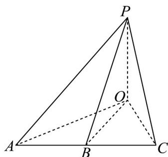

<!-- question-source:start -->
45. 某数学兴趣小组成员为测量某建筑的高度 $OP$ ，选取了在同一水平面上的 $A, B, C$ 三处，如图所示·已知在 $A, B, C$ 处测得该建筑顶部 $P$ 的仰角分别为 $30^{\circ}$ 、 $45^{\circ}$ 、 $60^{\circ}$ ， $\overline{OA} = 2\overline{OB} - \overline{OC}$ ， $AB = 10$ 米，则该建筑的高度 $OP =$ \_\_\_\_米·

<!-- question-source:end -->

![[高中/课堂同步/题库/人教A版高中数学同步讲义(2026)/02_必修第二册/第六章 平面向量及其应用/专项训练/专题03_平面向量的应用六大常考题型_高效培优专项训练_/题型五_sec_04/questions/answers/Q00065527A1.md]]
