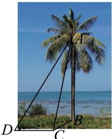
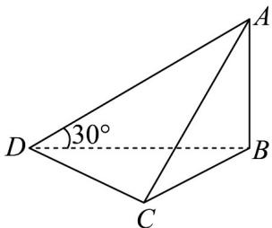

<!-- question-source:start -->
49. 如图 1，椰子树是海南最具代表性的树木之一，树干笔直无分枝，叶片形似巨大的羽毛伞·如图 2，D、C 两处观测点与树干底部点 B 在同一水平面内，树干 AB 垂直于水平面，某同学在地面 D 处，测得树干顶端 A 处的仰角为 $30^{\circ}$ ，D、C 两处相距 20 米， $\sqrt{3}\sin\angle DBC=\sin\angle DCB$ ， $\sqrt{3}BC=BD$ 。

图1

图2

(1)求观测点 $D$ 到树干底部点 $B$ 的距离 $BD$ 的长度；

(2)求在树干顶端 A 处观测到 C、D 两点的夹角 $\angle DAC$ 的余弦值.
<!-- question-source:end -->

![[高中/课堂同步/题库/人教A版高中数学同步讲义(2026)/02_必修第二册/第六章 平面向量及其应用/专项训练/专题03_平面向量的应用六大常考题型_高效培优专项训练_/题型五_sec_04/questions/answers/Q00065529A1.md]]
