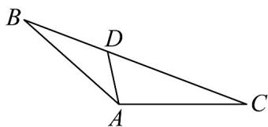
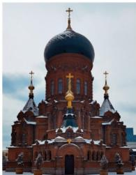
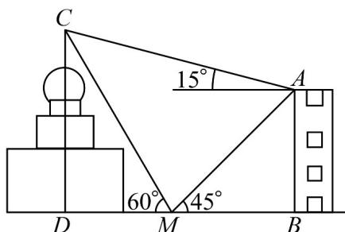

> [!faq]- 《专题03_平面向量的应用六大常考题型_高效培优专项训练_》官方解析
>
> > [!success]- **【答案】** $\sqrt{10}$
>
> > [!note]- **【解析】**
> > 
> >
> > 由余弦定理： $BC^{2} = AB^{2} + AC^{2} - 2AB\times AC\times \cos 135^{\circ}$
> >
> > 即 $BC^{2} = 36 + 18 + 36 = 90$
> >
> > 所以 $BC = 3\sqrt{10}$
> >
> > 由正弦定理可得： $\frac{BC}{\sin 135^\circ} = \frac{AC}{\sin B}$
> >
> > 可得： $\frac{3\sqrt{10}}{\sin 135^\circ} = \frac{3\sqrt{2}}{\sin B}$ ，即 $\sin B = \frac{\sqrt{10}}{10}$ ，所以 $\cos B = \frac{3\sqrt{10}}{10}$
> >
> > $$
> > B D = x
> > $$
> >
> > 由余弦定理可得 $\cos B = \frac{x^{2} + 6^{2} - x^{2}}{12x} = \frac{3\sqrt{10}}{10}$ ，
> >
> > 解得： $x=\sqrt{10}$ ，故答案为： $\sqrt{10}$
> >
> > 44. 圣·索菲亚教堂是哈尔滨的标志性建筑，其中央主体建筑集球、圆柱、棱柱于一体，极具对称之美·为了估算圣·索菲亚教堂的高度，某人在教堂的正东方向找到一座建筑物 $AB$ ，高约为 $36\mathrm{m}$ ，在它们之间的地面上的点 $M(B, M, D$ 三点共线）处测得建筑物顶 $A$ 、教堂顶 $C$ 的仰角分别是 $45^{\circ}$ 和 $60^{\circ}$ ，在建筑物顶 $A$ 处测得教堂顶 $C$ 的仰角为 $15^{\circ}$ ，则可估算圣·索菲亚教堂的高度 $CD$ 约为（）
> >
> > 【答案】
> >
> > 
> >
> > 
> >
> > A. $45\mathrm{m}$ B. $47\mathrm{m}$ C. $50\mathrm{m}$ D. $54\mathrm{m}$
> >
> > 【答案】D
> >
> > 【详解】由题可得在直角 $\triangle ABM$ 中， $\angle AMB = 45^{\circ}$ ， $AB = 36$ ，所以 $AM = \frac{AB}{\sin 45^{\circ}} = 36\sqrt{2}$ ，在 $\triangle AMC$ 中， $\angle AMC = 180^{\circ} - 60^{\circ} - 45^{\circ} = 75^{\circ}$ ， $\angle MAC = 15^{\circ} + 45^{\circ} = 60^{\circ}$ ，所以 $\angle ACM = 180^{\circ} - 75^{\circ} - 60^{\circ} = 45^{\circ}$ ，
> >
> > 所以由正弦定理可得 $\frac{AM}{\sin45^{\circ}}=\frac{CM}{\sin60^{\circ}}$ ，所以 $CM=\frac{36\sqrt{2}\times\frac{\sqrt{3}}{2}}{\frac{\sqrt{2}}{2}}=36\sqrt{3}$ ，
> >
> > 则在直角VCDM中， $CD = CM\cdot \sin 60^{\circ} = 54$
> >
> > 即圣·索菲亚教堂的高度约为 $54 \, m$ ·故答案为：D.
