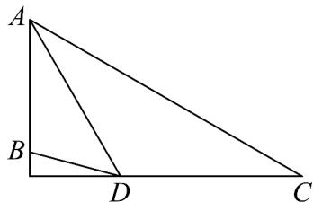
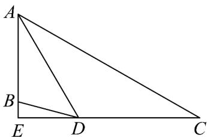
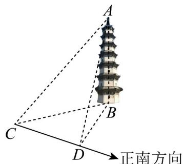

> [!faq]- 《专题03_平面向量的应用六大常考题型_高效培优专项训练_》官方解析
>
> > [!success]- **【答案】** $5 \sqrt{6}$
>
> > [!note]- **【解析】**
> > 设 $OP = x$ ，在直角三角形 $OAP$ 中，由 $\tan \angle PAO = \frac{OP}{OA}$ ，得 $OA = \sqrt{3} x$
> >
> > 在直角三角形 OBP 中，由 $\tan\angle PBO=\frac{OP}{OB}$ ，得 OB=x，
> >
> > 在直角三角形 OCP 中，由 $\tan\angle PCO=\frac{OP}{OC}$ ，得 $OC=\frac{\sqrt{3}}{3}x$ ，
> >
> > 由 $OA = 2OB - OC$ ，可得 B 是 AC 的中点，所以 AB = BC = 10，
> >
> > 因为 $\angle OBA + \angle OBC = \pi$ ，则 $\cos \angle OBA + \cos \angle OBC = 0$
> >
> > 在 $\triangle ABO$ ， $\triangle CBO$ 中，由余弦定理可得： $\frac{100 + x^2 - 3x^2}{2\times 10\times x} +\frac{100 + x^2 - \frac{1}{3}x^2}{2\times 10\times x} = 0$
> >
> > 解得 $x = 5\sqrt{6}$ ，所以该建筑的高度 $OP$ 为 $5\sqrt{6}$ 米．故答案为： $5\sqrt{6}$
> >
> > 46. 渝北中学大力传承和弘扬“红岩·莲华”精神，在王朴母子雕像前举行纪念活动·某同学为测量王朴母子雕像的高度 $AB$ （雕像的底端视为点 $B$ ，雕像的顶端视为点 $A$ ），在地面选取了两点 $C$ ， $D$ （其中 $A, B, C, D$ 四点在同一个铅垂平面内），在点 $C$ 处测得点 $A$ 的仰角为 $30^\circ$ ，在点 $D$ 处测得点 $A$ ， $B$ 的仰角分别为 $60^\circ, 15^\circ$ ，测得 $CD = 18(\sqrt{3} + 1)\mathrm{m}$ ，则按此法测得的王朴母子雕像 $AB$ 的高为（）
> >
> > 【答案】
> >
> > 
> >
> > A 34m B 35m C 36m D 37m
> >
> > 【答案】C
> >
> > 【详解】如图，设直线 $CD$ 与 $AB$ 交于点 $E$ ，则 $AE \perp CE$
> >
> > 
> >
> > 由题意得 $CE = \frac{AE}{\tan 30^{\circ}} = \sqrt{3}AE, DE = \frac{AE}{\tan 60^{\circ}} = \frac{\sqrt{3}}{3}AE$
> >
> > 又 $CD = 18(\sqrt{3} + 1)$ ，且 $CE - DE = CD$
> >
> > 代入解得 $AE = 9(3 + \sqrt{3})$ ，从而 $DE = 9(\sqrt{3} +1)$
> >
> > 进而 $BE = DE \cdot \tan 15^{\circ} = DE \cdot \tan (60^{\circ} - 45^{\circ}) = DE \cdot \frac{\sqrt{3} - 1}{1 + \sqrt{3}} = 9(\sqrt{3} - 1)$
> >
> > 则雕像高 AB = AE - BE = 36 米，故 C 正确·故选：C
> >
> > 47. 灵山江畔的龙洲塔，有“人文荟萃，学养深厚”的福地一说·如图，某同学为了测量龙洲塔的高度，在地面 $C$ 处测得塔在南偏东 $30^{\circ}$ 的方向上，向正南方向行走 $15\sqrt{2}$ 后到达 $D$ 处，测得塔在南偏东 $75^{\circ}$ 的方向上， $D$ 处测得塔尖 $A$ 的仰角为 $60^{\circ}$ ，则可得龙洲塔高度为（）
> >
> > 【答案】
> >
> > 
> >
> > A. $15\sqrt{2}$ B. $\frac{15}{2} (\sqrt{6} +\sqrt{2})$ C. $15\sqrt{3}$ D. $\frac{15}{2} (\sqrt{6} -\sqrt{2})$
> >
> > 【答案】C
> >
> > 【详解】由题意可知 $\angle BCD = 30^{\circ}, CD = 15\sqrt{2}$ ，所以 $\angle DBC = 75^{\circ} - 30^{\circ} = 45^{\circ}$ ，在 $\triangle BCD$ 中，由正弦定理可得 $\frac{BD}{\sin \angle BCD} = \frac{CD}{\sin \angle DBC} \Rightarrow BD = 15$ ，因为 $D$ 处测得塔尖 $A$ 的仰角为 $60^{\circ}$ ，即 $\angle ADB = 60^{\circ}$ ，则在 $Rt\triangle ABD$ 中，龙洲塔高度为 $AB = BD\tan \angle ADB = 15\sqrt{3}$ 。
> >
> > 故选 **C**.
