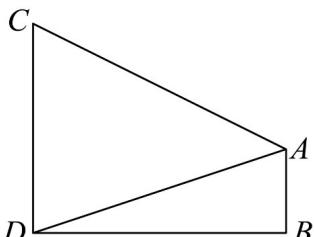
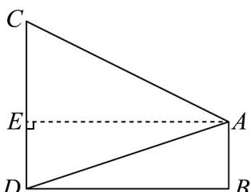

> [!faq]- 《专题03_平面向量的应用六大常考题型_高效培优专项训练_》官方解析
>
> > [!success]- **【答案】**  A. $30^{\circ}$ B. $45^{\circ}$ C. $60^{\circ}$ D. $75^{\circ}$
>
> > [!note]- **【解析】**
> > 如图，过点 A 作 $AE \perp CD$ 于点 E，
> >
> > 
> >
> > 由题可知， $AE = BD = 60\mathrm{m}$ ， $DE = AB = 20\mathrm{m}$ ， $CE = CD - DE = 30\mathrm{m}$ 在 $\mathrm{Rt}^{\triangle}ABD$ 中，由勾股定理得： $AD = \sqrt{AB^2 + BD^2} = \sqrt{20^2 + 60^2} = 20\sqrt{10}$ 在 $\mathrm{Rt}\triangle ACE$ 中，由勾股定理得： $AC = \sqrt{AE^2 + CE^2} = \sqrt{60^2 + 30^2} = 30\sqrt{5}$
> >
> > 在 $\triangle ACD$ 中，由余弦定理得： $\cos \angle CAD = \frac{AC^2 + AD^2 - CD^2}{2AC \cdot AD} = \frac{(30\sqrt{5})^2 + (20\sqrt{10})^2 - 50^2}{2 \times 30\sqrt{5} \times 20\sqrt{10}} = \frac{\sqrt{2}}{2}$ ，
> >
> > 因为 $0^{\circ} < \angle CAD < 180^{\circ}$ ，所以 $\angle CAD = 45^{\circ}$ 。
> >
> > 故选 **B**
