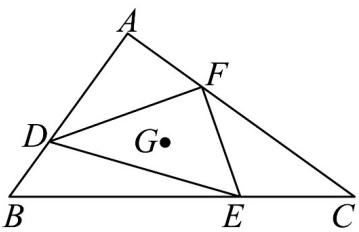

<!-- question-source:start -->
2. 如图，已知 $\mathrm{V}ABC$ ， $D,E,F$ 分别是 $AB$ ， $BC,CA$ 上的动点，且满足 $\frac{AB}{AD} = \frac{BC}{BE} = \frac{CA}{CF}$ ，求证：在 $D,E,F$ 三点运动过程中， $\triangle DEF$ 的重心 $G$ 不动。

<!-- question-source:end -->

![[高中/课堂同步/题库/人教A版高中数学同步讲义(2026)/02_必修第二册/第六章 平面向量及其应用/专题01 平面向量的运算七大常考题型（高效培优专项训练）/题型一_向量的混合运算/questions/answers/Q00078204A1.md]]
