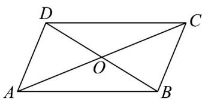

<!-- question-source:start -->
7. 如图，在平行四边形 $ABCD$ 中， $AC = a, DO = b$ ，则 $CB = (\quad)$

$$
\frac {1}{2} a + b
$$

B. $-\frac{1}{2} a + b$

$$
- \frac {1}{2} a - b
$$

$$
\frac {1}{2} \vec {a} - \vec {b}
$$
<!-- question-source:end -->

![[高中/课堂同步/题库/人教A版高中数学同步讲义(2026)/02_必修第二册/第六章 平面向量及其应用/专题01 平面向量的运算七大常考题型（高效培优专项训练）/题型一_向量的混合运算/questions/answers/Q00078209A1.md]]
