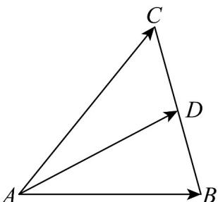

> [!faq]- 《专题01 平面向量的运算七大常考题型（高效培优专项训练）》官方解析
>
> > [!success]- **【答案】** 重
>
> > [!note]- **【解析】**
> > 由 $OP = OA + \lambda (AB + AC)$ ，则 $AP = \lambda (AB + AC)$
> >
> > 取 $BC$ 的中点为 $D$ ，如下图：
> >
> > 
> >
> > 可得 $AP = 2\lambda AD$ ，所以动点 P 必定在 VABC 的中线所在直线上，即点 P 的轨迹一定通过 VABC 的重心。
> >
> > 故答案为：重·
