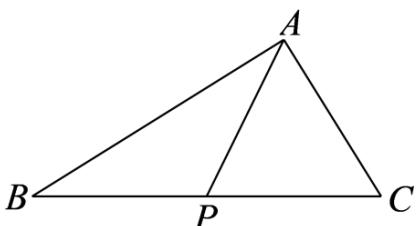

> [!faq]- 《专题01 平面向量的运算七大常考题型（高效培优专项训练）》官方解析
>
> > [!success]- **【答案】** $\sqrt{2}$
>
> > [!note]- **【解析】**
> > 因为点 A 在线段 BC 外， $\left|AB+AC\right|=\left|AB-AC\right|$
> >
> > 所以 $\left|AB + AC\right|^{2} = \left|AB - AC\right|^{2}$ ，即 $AB^{2} + 2AB \cdot AC + AC^{2} = AB^{2} - 2AB \cdot AC + AC^{2}$ ，
> >
> > 所以 $AB \cdot AC = 0$ ，所以 $AB \perp AC$
> >
> > 因为 $\left| \overline{BC} \right|^2 = 8$ ，所以 $\left| \overline{BC} \right| = 2\sqrt{2}$
> >
> > 
> >
> > 因为 $P$ 为线段 $BC$ 的中点，所以 $\left|\overline{AP}\right| = \frac{1}{2}\left|\overline{BC}\right| = \frac{1}{2} \times 2\sqrt{2} = \sqrt{2}$ .
> >
> > 故答案为： $\sqrt{2}$
