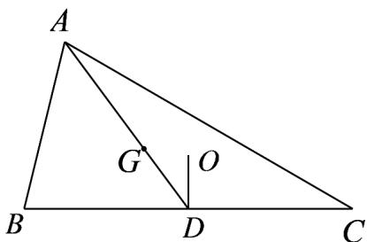

> [!faq]- 《专题01 平面向量的运算七大常考题型（高效培优专项训练）》官方解析
>
> > [!success]- **【答案】** 2
>
> > [!note]- **【解析】**
> > 因为 $G$ 是 $\mathrm{V}ABC$ 的重心，所以 $AG = \frac{1}{3}\left(AB + AC\right)$
> >
> > 记 $BC$ 的中点为 $D$ ，则 $\overline{GD} = \frac{1}{6}\left( \overline{AB} + \overline{AC} \right)$
> >
> > 
> >
> > 因为 O 是 VABC 的外心，所以 $OD \perp BC$ ，即 $OD \cdot BC = 0$
> >
> > 于是 $GO \cdot BC = (GD + DO) \cdot BC = GD \cdot BC = \frac{1}{6} (AB + AC) \cdot (AC - AB)$ $= \frac{1}{6} (AC^{2} - AB^{2}) = 2$ .
> >
> > 故答案为：2
