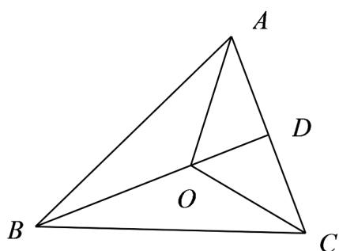

> [!faq]- 《专题01 平面向量的运算七大常考题型（高效培优专项训练）》官方解析
>
> > [!success]- **【答案】** A．若 $a \parallel b$ ， $b \parallel c$ ，则 $a \parallel c$ B．在 $\triangle ABC$ 中，若 $\overline{OA} + \overline{OB} + \overline{OC} = 0$ ，则 $\triangle AOC$ 与 $\triangle ABC$ 的面积之比为1:3 C．两个非零向量 $a$ ， $b$ ，若 $\left|a - b\right| = \left|a\right| + \left|b\right|$ ，则 $a$ 与 $b$ 共线且反向 D．若 $a \parallel b$ ，则存在唯一实数 $\lambda$ 使得 $a = \lambda b$
>
> > [!note]- **【解析】**
> > 对于 A，当 b=0 时，因为零向量与任意向量都平行，所以 $a \parallel b$ ， $b \parallel c$ 成立，而此时 a,c 不一定平行，所以 A 错误，
> > 对于 B，因为 $OA + OB + OC = 0$ ，所以 $OA + OC = -OB$ ，设 D 为 AC 的中点，连接 OD，
> > 则 $2OD = -OB$ ，所以 $BD = 3OD$ ，所以点 B 到 AC 的距离等于点 O 到 AC 的距离的 $^{3}$ 倍，
> > 所以 $\triangle AOC$ 与 $\triangle ABC$ 的面积之比为 1:3，所以 B 正确，
> >
> > 
> >
> > 对于 $\mathbb{C}$ ，由 $\left|a - b\right| = \left|a\right| + \left|b\right|$ ，得 $\left|a - b\right|^2 = \left(\left|a\right| + \left|b\right|\right)^2$ ，化简得 $a\cdot b = -\left|a\right|\cdot \left|b\right|$
> >
> > 所以 $\cos\left\langle a,b\right\rangle=-1$ ，所以 a 与 b 的夹角为 $180^{\circ}$ ，所以 a 与 b 共线且反向，所以 C 正确，
> > 对于 D，当 b=0 时，不存在唯一实数 $\lambda$ 使得 $a=\lambda b$ ，所以 D 错误。
> >
> > 故选 **BC**
