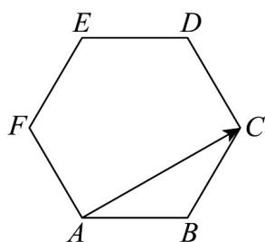

<!-- question-source:start -->
11. 如图，在正六边形 $ABCDEF$ 中， $AC = (\quad)$

A. $2AB + AF$ B. $AB - 2AF$ C. $2AB + 2AF$ D. $AB + 2AF$
<!-- question-source:end -->

![[高中/课堂同步/题库/人教A版高中数学同步讲义(2026)/02_必修第二册/第六章 平面向量及其应用/专题01 平面向量的运算七大常考题型（高效培优专项训练）/题型二_向量加减法的实际应用/questions/answers/Q00078213A1.md]]
