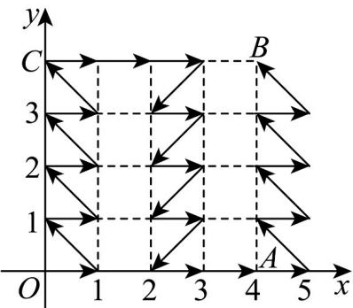

> [!faq]- 《专题01 平面向量的运算七大常考题型（高效培优专项训练）》官方解析
>
> > [!success]- **【答案】** D
>
> > [!note]- **【解析】**
> > 因 $a$ ， $b$ 是两个非零向量，则 $\left|a + b\right|\leq \left|a\right| + \left|b\right|$ ，当且仅当 $a$ 与 $b$ 同向共线时等号成立，故D正确故选：D.
> >
> > 13．平面直角坐标系中，点 M 从原点 O 出发，每步只能按向量 $a=(1,0)$ ， $b=(-1,1)$ ， $c=(-1,-1)$ 运动·若 M 要走遍以 O， $A(4,0)$ ， $B(4,4)$ ， $C(0,4)$ 为顶点的正方形中所有整点（包含边界），至少要走\_\_\_\_步·
> > 【答案】 $^{28}$
> >
> > 【详解】
> >
> > 
> >
> > 如图， $(0,0)\xrightarrow{a}(1,0)\xrightarrow{b}(0,1)\xrightarrow{a}(1,1)\xrightarrow{b}(0,2)\xrightarrow{a}(1,2)\xrightarrow{b}(0,3)$
> >
> > $$
> > \stackrel {a} {\rightarrow} (1, 3) \stackrel {b} {\rightarrow} (0, 4) \stackrel {a} {\rightarrow} (1, 4) \stackrel {a} {\rightarrow} (2, 4) \stackrel {a} {\rightarrow} (3, 4) \stackrel {c} {\rightarrow} (2, 3) \stackrel {a} {\rightarrow} (3, 3)
> > $$
> >
> > $$
> > \stackrel {c} {\rightarrow} (2, 2) \stackrel {a} {\rightarrow} (3, 2) \stackrel {c} {\rightarrow} (2, 1) \stackrel {a} {\rightarrow} (3, 1) \stackrel {c} {\rightarrow} (2, 0) \stackrel {a} {\rightarrow} (3, 0) \stackrel {a} {\rightarrow} (4, 0)
> > $$
> >
> > $$
> > \stackrel {a} {\rightarrow} (5, 0) \stackrel {b} {\rightarrow} (4, 1) \stackrel {a} {\rightarrow} (5, 1) \stackrel {b} {\rightarrow} (4, 2) \stackrel {a} {\rightarrow} (5, 2) \stackrel {b} {\rightarrow} (4, 3) \stackrel {a} {\rightarrow} (5, 3) \stackrel {b} {\rightarrow} (4, 4),
> > $$
> >
> > 共需 $^{28}$ 步·
> >
> > 故答案为：28.
