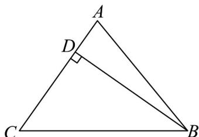

> [!faq]- 《专题01 平面向量的运算七大常考题型（高效培优专项训练）》官方解析
>
> > [!success]- **【答案】** $\sqrt{7}$
>
> > [!note]- **【解析】**
> > 过点 B 作 $BD \perp AC$ 于点 D，
> >
> > 则 $\left|AB-tAC\right|$ 的最小值为 $\left|BD\right|$ ，即 $\left|BD\right|=\frac{\sqrt{3}}{2}\left|BC\right|$ ，
> >
> > 在 $\mathrm{Rt}^{\triangle}$ BCD 中， $\sin C = \frac{\left|\begin{matrix} \square\square\square \\ BD \\ \square\square\square \\ BC \end{matrix}\right|}{\left|\begin{matrix} BC \\ BC \end{matrix}\right|} = \frac{\sqrt{3}}{2}$ ，
> >
> > 因为 $\mathrm{V}ABC$ 为锐角三角形，所以 $C = \frac{\pi}{3}$ ，则 $B = \frac{2\pi}{3} - A$
> >
> > 所以 $\sin A + 2\sin B = \sin A + 2\sin \left(\frac{2\pi}{3} -A\right) = \sin A + \sqrt{3}\cos A + \sin A$
> >
> > $= 2\sin A + \sqrt{3}\cos A = \sqrt{7}\sin (A + \varphi),\tan \varphi = \frac{\sqrt{3}}{2},\varphi \in \left(0,\frac{\pi}{2}\right)$
> >
> > 因为 $A \in \left(0, \frac{\pi}{2}\right), B = \frac{2\pi}{3} - A \in \left(0, \frac{\pi}{2}\right)$ ，所以 $A \in \left(\frac{\pi}{6}, \frac{\pi}{2}\right)$
> >
> > 所以 $A + \varphi \in \left(\frac{\pi}{6},\pi\right)$ ，所以 $\sqrt{7}\sin (A + \varphi)\leq \sqrt{7}$
> >
> > 即 $\sin A + 2\sin B$ 的最大值为 $\sqrt{7}$
> >
> > 故答案为： $\sqrt{7}$
> >
> > 
