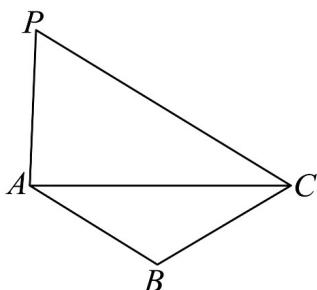

> [!faq]- 《专题01 平面向量的运算七大常考题型（高效培优专项训练）》官方解析
>
> > [!success]- **【答案】** D
>
> > [!note]- **【解析】**
> > 因为 $PA - PB + PC = BA + PC = AB$ ，得到 $PC = 2AB$
> >
> > 如图， $PC / / AB$ 且 $PC = 2AB$ ，则 $C$ 到 $AB$ 的距离等于 $A$ 到 $PC$ 的距离相等，又 $S_{\triangle ABC} = 1$ ，所以 $S_{\triangle PAC} = 2$ ，
> >
> > 
> >
> > 故选 **D**.
