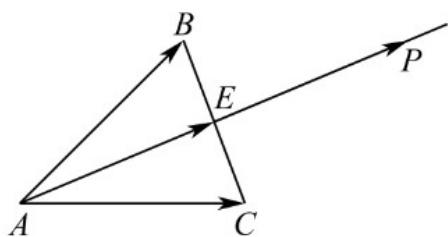

> [!faq]- 《专题01 平面向量的运算七大常考题型（高效培优专项训练）》官方解析
>
> > [!success]- **【答案】** A
>
> > [!note]- **【解析】**
> > 取线段 BC 的中点 E ，则 $AB + AC = 2AE$
> >
> > 动点 $P$ 满足： $OP = OA + \lambda (AB + AC)$ ， $\lambda \in \mathbb{R}$
> >
> > 则 $OP - OA = 2\lambda AE$ ，即 $AP = 2\lambda AE$ ，所以 $AP / / AE$
> >
> > 又 $AP \cap AE = A$ ，所以 $A, E, P$ 三点共线，即点 $P$ 的轨迹是直线 $AE$
> >
> > 一定通过VABC的重心.
> >
> > 故选：A.
> >
> > 
