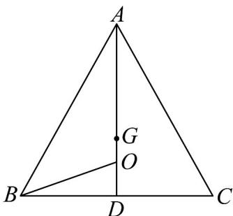
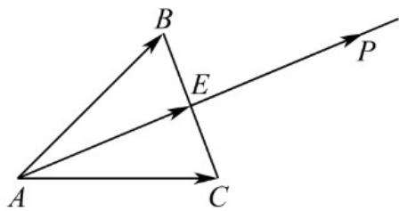

> [!faq]- 《专题01 平面向量的运算七大常考题型（高效培优专项训练）》官方解析
>
> > [!success]- **【答案】** D
>
> > [!note]- **【解析】**
> > 取 BC 的中点 D，连接 AD，则 $\overline{AD} = \frac{1}{2} \left( \overline{AB} + \overline{AC} \right)$ ，
> > 由 $GA + GB + GC = 0$ ，知 G 为 VABC 的重心，则 G 在 AD 上，
> > 所以 $AG = \frac{1}{3}(AB + AC) = \frac{2}{3}AD$ ，而 $AO = \frac{5}{12} \left( AB + AC \right) = \frac{5}{6} AD$ ，
> > 所以 A, G, O, D 四点共线，所以 AB = AC，即 $AD \perp BC$ ，
> > 不妨令 AD = 6，则 AO = BO = 5，OD = 1，则 $BD = \sqrt{5^{2} - 1^{2}} = 2\sqrt{6}$ ，
> > 所以 $\sin\angle BOG=\sin\angle BOD=\frac{BD}{BO}=\frac{2\sqrt{6}}{5}$
> >
> > 
> >
> > 故选：D.
> >
> > 36. O 是平面上一定点，A, B, C 是平面上不共线的三个点，动点 P 满足 $OP = OA + \lambda(AB + AC)$ ， $\lambda \in [0, +\infty)$ ，则 P 的轨迹一定通过 VABC 的（）
> >
> > 【答案】
> >
> > A. 外心    B. 垂心    C. 内心    D. 重心
> >
> > 【答案】D
> >
> > 【详解】取线段 BC 的中点 E ，则 $AB + AC = 2AE$
> >
> > 动点 $P$ 满足： $OP = OA + \lambda (AB + AC)$ ， $\lambda \in [0, +\infty)$
> >
> > 则 $OP - OA = 2\lambda AE$ ，即 $AP = 2\lambda AE$ ，所以 $AP / / AE$ 又 $AP \cap AE = A$ ，所以 $A, E, P$ 三点共线，
> >
> > 则直线 AP 一定通过 VABC 的重心.
> >
> > 故选：D.
> >
> > 
