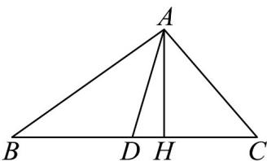

> [!faq]- 《专题01 平面向量的运算七大常考题型（高效培优专项训练）》官方解析
>
> > [!success]- **【答案】** 重心
>
> > [!note]- **【解析】**
> > 过 A 作 $AH \perp BC$ ，垂足为 H，取 BC 中点为 D，连接 AD，如下所示：
> >
> > 
> >
> > 则 $\left|AB\right|\sin B=\left|AH\right|=\left|AC\right|\sin C$
> >
> > 则 $\overrightarrow{OP} = \overrightarrow{OA} +\lambda \left( \begin{array}{c}\overrightarrow{AB}\\ \overrightarrow{AB}\mid \sin B \end{array} +\overrightarrow{AC}\right)$ ，则 $\lambda \left( \begin{array}{c}\overrightarrow{AB}\\ \overrightarrow{AB}\mid \sin B \end{array} +\overrightarrow{AC}\right)$ $A P =$
> >
> > $\overrightarrow{AP}=\lambda\left(\frac{\overrightarrow{AB}}{|AH|}+\frac{\overrightarrow{AC}}{|AH|}\right)=\frac{\lambda}{|AH|}\left(\overrightarrow{AB}+\overrightarrow{AC}\right)=\frac{2\lambda}{|AH|}\overrightarrow{AD}$ ，又 $\frac{2\lambda}{|AH|}$ 为非负实数，
> >
> > $$
> > \begin{array}{c} \text {卍卍卍卍卍卍卍卍卍卍卍卍卍卍卍卍卍卍卍卍卍卍卍卍卍卍卍卍卍卍卍卍卍卍卍卍卍卍卍卍卍卍卍卍卍卍卍卍卍卍卐, A P , A D} \end{array}
> > $$
> >
> > $$
> > A, P, D \text {三点}
> > $$
> >
> > $$
> > A B C
> > $$
> >
> > $$
> > A B C
> > $$
> >
> > 故答案为：重心·
