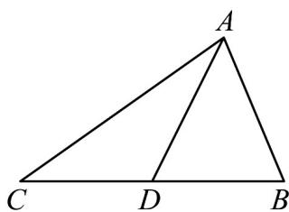

> [!faq]- 《专题01 平面向量的运算七大常考题型（高效培优专项训练）》官方解析
>
> > [!success]- **【答案】** A．两个具有共同终点的向量，一定是共线向量 B．若a与b同向，且 $|a|>|b|$ ，则a>b C． $\lambda$ 、 $\mu$ 为实数，若 $\lambda a=\mu b$ ，则a与b共线 D．P 是 VABC 所在平面上的任意一点，且满足 $OP = OA + \lambda(AB + AC)$ ， $\lambda \in (0, +\infty)$ ，则直线 AP 一定通过 VABC 的重心
>
> > [!note]- **【解析】**
> > A，当两起点与终点不在同一直线上时，虽然终点相同，向量不共线，错，
> >
> > B，两个向量不能比较大小，错，
> >
> > C，当 $\lambda = \mu = 0$ 时， $a$ 与 $b$ 可以为任意向量，满足 $\lambda a = \mu b$ ，但 $a$ 与 $b$ 不一定共线，错，
> >
> > D，如图所示，取BC中点D， $OP = OA + \lambda (AB + AC)$ ，即 $OP - OA = \lambda (AB + AC)$
> >
> > $\therefore AP=2\lambda AD$ ，即 A、P、D 三点共线，故 AP 一定通过 VABC 的重心，对
> >
> > 
> >
> > 故选 **ABC**
