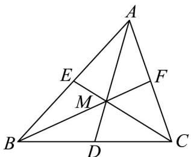

## 题型四：根据向量关系判断三角形的心

31. “奔驰定理”是平面向量中一个非常优美的结论，因为这个定理对应的图形与“奔驰”轿车，

(Mercedesbenz) 的 logo 很相似，故形象地称其为“奔驰定理”，奔驰定理：已知 M 是 VABC 内一点，

△ BMC、△AMC、△AMB 的面积分别为 $S_{A}$ 、 $S_{B}$ 、 $S_{C}$ ，且 $S_{A} \cdot MA + S_{B} \cdot MB + S_{C} \cdot MC = 0$ 。则下列说法正确的是（）

A. 若 $S_{A}: S_{B}: S_{C} = 1: 1: 1$ ，则 $M$ 为 $\mathrm{VABC}$ 的重心

B．若 $S_{A}:S_{B}:S_{C}=1:2:3$ ，则 $AM=\frac{1}{3}AB+\frac{1}{2}AC$

C. 若 $AM = \frac{1}{4} AB + \frac{1}{3} AC$ ，则 $\frac{S_{A}}{S_{\triangle ABC}} = \frac{1}{3}$

D．若 $M$ 为 $\mathrm{V}ABC$ 的内心，且 $3\overline{MA} +4\overline{MB} +\sqrt{7}\overline{MC} = 0$ ，则 $\cos C = \frac{3}{4}$

【答案】ABD

【详解】对于 A 选项，若 $S_{A}:S_{B}:S_{C}=1:1:1$ ，则 $MA+MB+MC=0$

取线段 $BC$ 的中点 $D$ ，连接 $DM$ ，则 $\overline{MB} +\overline{MC} = (\overline{MD} +\overline{DB}) + (\overline{MD} +\overline{DC}) = 2\overline{MD}$

所以， $MA + MB + MC = MA + 2MD = 0$ ，即 $MA = -2MD$ ，故 A、M、D 三点共线，

分别取线段 AB 、 AC 的中点 E 、 F ，连接 ME 、 MF ，

同理可证 B、M、F 三点共线，C、M、E 三点共线，则 M 为 VABC 的重心，因此，若 $S_{A}:S_{B}:S_{C}=1:1:1$ ，则 M 为 VABC 的重心，A 对；

对于 B 选项，若 $S_{A}:S_{B}:S_{C}=1:2:3$ ，由“奔驰定理”可得 $\overline{MA}+2\overline{MB}+3\overline{MC}=0$

所以， $\stackrel{\square\square}{MA}+2\left(\stackrel{\square\square}{MA}+\stackrel{\square\square}{AB}\right)+3\left(\stackrel{\square\square}{MA}+\stackrel{\square\square}{AC}\right)=0$ ，所以， $6\stackrel{\square\square}{AM}=2\stackrel{\square\square}{AB}+3\stackrel{\square\square}{AC}$

故 $\overset{\square\square\square}{AM}=\frac{1}{3}\overset{\square\square\square}{AB}+\frac{1}{2}\overset{\square\square\square}{AC}$ ，B对；

对于 C 选项，若 $\frac{AM}{4} = \frac{1}{4} AB + \frac{1}{3} AC$ ，即 $12AM = 3AB + 4AC$ ，

即 $12\overline{AM} = 3\left(\overline{AM} +\overline{MB}\right) + 4\left(\overline{AM} +\overline{MC}\right)$ ，即 $5\overline{MA} +3\overline{MB} +4\overline{MC} = 0$

又 $S_{A} \cdot \overline{MA} + S_{B} \cdot \overline{MB} + S_{C} \cdot \overline{MC} = 0$ ， $\overline{MA}, \overline{MB}, \overline{MC}$ 不共线，

所以 $S_{A}: S_{B}: S_{C} = 5:3:4$

所以由“奔驰定理”可得 $\frac{S_A}{S_{\triangle ABC}} = \frac{S_A}{S_A + S_B + S_C} = \frac{5}{5 + 4 + 3} = \frac{5}{12} \neq \frac{1}{3}$ ，C 错；

对于 $^{D}$ 选项，若M为VABC的内心，设VABC的内切圆半径为r，

$$
S _ {A}: S _ {B}: S _ {C} = \left(\frac {1}{2} B C \cdot r\right): \left(\frac {1}{2} A C \cdot r\right): \left(\frac {1}{2} A B \cdot r\right) = B C: A C: A B
$$

因为 $3\overline{MA} + 4\overline{MB} + \sqrt{7}\overline{MC} = 0$ ，则 $S_A:S_B:S_C = 3:4:\sqrt{7}$ ，故 $BC:AC:AB = 3:4:\sqrt{7}$

设 $BC = 3t(t > 0)$ ，则 $AC = 4t$ ， $AB = \sqrt{7} t$ ，则 $BC^2 + AB^2 = AC^2$ ，故 $\angle ABC$ 为直角，

所以， $\cos C = \frac{BC}{AC} = \frac{3}{4}$ ，D对.

故选：ABD.

![[高中/课堂同步/题库/人教A版高中数学同步讲义(2026)/02_必修第二册/第六章 平面向量及其应用/专题01 平面向量的运算七大常考题型（高效培优专项训练）/题型四_根据向量关系判断三角形的心/questions/Q00078232.md]]
![[高中/课堂同步/题库/人教A版高中数学同步讲义(2026)/02_必修第二册/第六章 平面向量及其应用/专题01 平面向量的运算七大常考题型（高效培优专项训练）/题型四_根据向量关系判断三角形的心/questions/Q00078233.md]]
![[高中/课堂同步/题库/人教A版高中数学同步讲义(2026)/02_必修第二册/第六章 平面向量及其应用/专题01 平面向量的运算七大常考题型（高效培优专项训练）/题型四_根据向量关系判断三角形的心/questions/Q00078234.md]]
![[高中/课堂同步/题库/人教A版高中数学同步讲义(2026)/02_必修第二册/第六章 平面向量及其应用/专题01 平面向量的运算七大常考题型（高效培优专项训练）/题型四_根据向量关系判断三角形的心/questions/Q00078235.md]]
![[高中/课堂同步/题库/人教A版高中数学同步讲义(2026)/02_必修第二册/第六章 平面向量及其应用/专题01 平面向量的运算七大常考题型（高效培优专项训练）/题型四_根据向量关系判断三角形的心/questions/Q00078236.md]]
![[高中/课堂同步/题库/人教A版高中数学同步讲义(2026)/02_必修第二册/第六章 平面向量及其应用/专题01 平面向量的运算七大常考题型（高效培优专项训练）/题型四_根据向量关系判断三角形的心/questions/Q00078237.md]]
![[高中/课堂同步/题库/人教A版高中数学同步讲义(2026)/02_必修第二册/第六章 平面向量及其应用/专题01 平面向量的运算七大常考题型（高效培优专项训练）/题型四_根据向量关系判断三角形的心/questions/Q00078238.md]]
![[高中/课堂同步/题库/人教A版高中数学同步讲义(2026)/02_必修第二册/第六章 平面向量及其应用/专题01 平面向量的运算七大常考题型（高效培优专项训练）/题型四_根据向量关系判断三角形的心/questions/Q00078239.md]]
