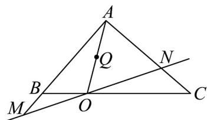

> [!faq]- 《专题02 平面向量基本定理及坐标表示六大常考题型（高效培优专项训练）》官方解析
>
> > [!success]- **【答案】** A. $\overline{AO} = \frac{2}{3} AB + \frac{1}{3} AC$ B. $\overline{BQ} = -\frac{2}{3} AB + \frac{1}{6} AC$ C. $2m + n = 3$ D. $\frac{1}{m} + \frac{1}{n}$ 的最小值为 $3 + 2\sqrt{2}$
>
> > [!note]- **【解析】**
> > 对于 A：根据题意画出图像，则根据已知条件可得 $AO = AB + BO = AB + \frac{1}{3} BC = AB + \frac{1}{3}(AC - AB) = \frac{2}{3} AB + \frac{1}{3} AC$ ，A 正确；
> >
> > 对于 B： $BQ = BA + AQ = -AB + \frac{1}{2} AO$ ，由 A 知 $AO = \frac{2}{3} AB + \frac{1}{3} AC$ 。
> >
> > 所以 $BQ = -AB + \frac{1}{2} AO = -AB + \frac{1}{2}\left(\frac{2}{3} AB + \frac{1}{3} AC\right) = -\frac{2}{3} AB + \frac{1}{6} AC$ ，B 正确；
> >
> > 对于 C：因为 $AB = mAM$ ， $AC = nAN$ ，m > 0, n > 0，
> >
> > 所以 $AM = \frac{1}{m} AB, AN = \frac{1}{n} AC$ 。
> >
> > 因为点 M, O, N 共线，所以设 $MO = \lambda ON, \lambda > 0$ 。
> >
> > 所以 $\overset{\text{UUU}}{AO}-\overset{\text{UUUU}}{AM}=\lambda\left(\overset{\text{UUU}}{AN}-\overset{\text{UUU}}{AO}\right)$ ，化简得 $(\lambda+1)\overset{\text{UUU}}{AO}=\overset{\text{UUUU}}{AM}+\lambda\overset{\text{UUU}}{AN}$ .
> >
> > 即 $\overline{AO}=\frac{1}{\lambda+1}\overline{AM}+\frac{\lambda}{\lambda+1}\overline{AN}$ ，又 $\overline{AO}=\frac{2}{3}\overline{AB}+\frac{1}{3}\overline{AC}=\frac{2m}{3}\overline{AM}+\frac{n}{3}\overline{AN}$
> >
> > 所以 $\left\{\begin{aligned}\frac{1}{\lambda+1}&=\frac{2m}{3}\\\frac{\lambda}{\lambda+1}&=\frac{n}{3}\end{aligned}\right.$ ，两式相加得 $\frac{2m}{3}+\frac{n}{3}=1$ ，即 $2m+n=3$ ， $^{C}$ 正确；
> >
> > 对于 D：由 C 知 $2m + n = 3$ ，所以
> >
> > $$
> > \frac {1}{m} + \frac {1}{n} = \frac {1}{3} \left(\frac {1}{m} + \frac {1}{n}\right) (2 m + n) = \frac {1}{3} \left(2 + \frac {n}{m} + \frac {2 m}{n} + 1\right) = 1 + \frac {1}{3} \left(\frac {n}{m} + \frac {2 m}{n}\right) \quad 1 + \frac {1}{3} \cdot 2 \sqrt {\frac {n}{m} \cdot \frac {2 m}{n}} = \frac {2 \sqrt {2}}{3} + 1.
> > $$
> >
> > 所以 D 错误·
> >
> > 故选：D
> >
> > 
