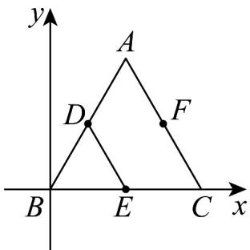

> [!faq]- 《专题02 平面向量基本定理及坐标表示六大常考题型（高效培优专项训练）》官方解析
>
> > [!success]- **【答案】** ACD
>
> > [!note]- **【解析】**
> > 
> >
> > 因为 $E(2,0)$ ， $F(3,2)$ ，所以 $EF=(3,2)-(2,0)=(1,2)$ ，故 A 正确；
> >
> > 因为 D, E 分别为 AB ， BC 的中点，
> >
> > 所以 $CF = ED = (1, 2) - (2, 0) = (-1, 2)$ ，故 B 错误；
> >
> > 设 $A(x,y)$ ， $B(m,n)$ ， $C(p,q)$
> >
> > 则有 $\left\{ \begin{array}{l} 1 = \frac{x + m}{2} \\ 2 = \frac{y + n}{2} \end{array} \right.$ ， $\left\{ \begin{array}{l} 2 = \frac{m + p}{2} \\ 0 = \frac{n + q}{2} \end{array} \right.$ ， $\left\{ \begin{array}{l} 3 = \frac{x + p}{2} \\ 2 = \frac{y + q}{2} \end{array} \right.$
> >
> > 解得 $A(2,4), B(0,0), C(4,0)$ ，故 $\mathbb{C}$ 正确；
> >
> > 由 C 可知 $S_{\triangle ABC} = \frac{1}{2} \times 4 \times 4 = 8$ ， $S_{\triangle BCF} = \frac{1}{2} \times 4 \times 2 = 4$
> >
> > 所以 $\triangle ABF$ 的面积为 $S_{\triangle ABC} - S_{\triangle BCF} = 8 - 4 = 4$ ，故D正确.
> >
> > 故选 **ACD**
