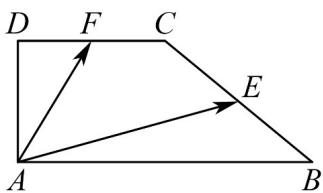
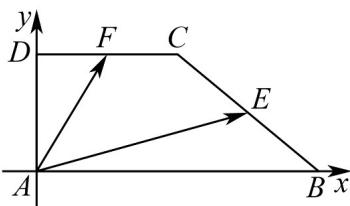

> [!faq]- 《专题02 平面向量基本定理及坐标表示六大常考题型（高效培优专项训练）》官方解析
>
> > [!success]- **【答案】**  A. 2 B. 4 C. 6 D. 8
>
> > [!note]- **【解析】**
> > 以 A 为原点建立平面直角坐标系，如图：
> >
> > 
> >
> > 设 $C(t,2)$ （ $t > 0$ ），则 $B(2t,0)$ ，所以 $E\left(\frac{3t}{2},1\right),F\left(\frac{t}{2},2\right)$
> >
> > 所以 $\overset{\square\square\square}{AE}=\left(\frac{3t}{2},1\right)$ ， $\overset{\square\square\square}{AF}=\left(\frac{t}{2},2\right)$
> >
> > 由 $\frac{\square\square\square}{AF} \cdot \frac{\square\square\square}{AE} = 14 \Rightarrow \frac{3}{4} t^2 + 2 = 14$ ，又 $t > 0$ ，所以 $t = 4$ 。
> >
> > 所以 $\left| \overline{CD} \right| = 4$
> >
> > 故选 **B**
