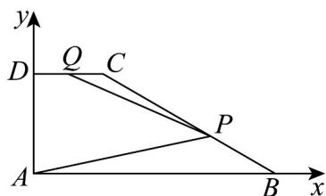

> [!faq]- 《专题02 平面向量基本定理及坐标表示六大常考题型（高效培优专项训练）》官方解析
>
> > [!success]- **【答案】** C
>
> > [!note]- **【解析】**
> > 以 AB 所在直线为 x 轴，AD 所在直线为 y 轴，建立平面直角坐标系，
> >
> > 
> >
> > 则 $A(0,0), B(3,0)$
> >
> > 设 $D(0,t), t > 0$ ，则 $C(1,t)$ ， $Q\left(\frac{1}{2}, t\right)$ ， $P\left(\frac{7}{3}, \frac{t}{3}\right)$
> >
> > 则 $AP = \left(\frac{7}{3},\frac{t}{3}\right)$ ， $PQ = \left(-\frac{11}{6},\frac{2t}{3}\right)$
> >
> > 所以 $\overrightarrow{AP} \cdot \overrightarrow{PQ} = -\frac{77}{18} + \frac{2t^{2}}{9} = -\frac{19}{6}$ ，解得 $t = \sqrt{5}$ ，
> >
> > 所以 $\left|BC\right|=\sqrt{2^{2}+t^{2}}=3$ .
> >
> > 故选 **C**.
