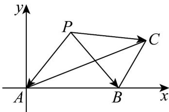

> [!faq]- 《专题02 平面向量基本定理及坐标表示六大常考题型（高效培优专项训练）》官方解析
>
> > [!success]- **【答案】** (1) $5-3\sqrt{2}$ (2) $\frac{\sqrt{3}}{6}$ (3) $\frac{3\sqrt{2}-5}{2}$
>
> > [!note]- **【解析】**
> > （1） $\left(\frac{AB}{2}\frac{AC}{2}\right)^{2}=\left|\frac{AB}{2}\right|^{2}-\frac{AB\cdot AC}{4}\left|\frac{AC}{4}\right|^{2}$ ，而 $AB\cdot AC=\left|AB\right|\cdot\left|AC\right|\cos\angle BAC=3\sqrt{2}$ ，所以 $\left(\frac{AB}{2}\frac{AC}{2}\right)^{2}=5-3\sqrt{2}$
> >
> > (2) 设 $\angle BAC = \theta$ ， $\left|AC + tAB\right|^2 = 12 + 4\sqrt{6}t\cos \theta + 2t^2$ ，由题意知 $\left|AC + tAB\right|^2$ 的最小值为 $1$ ，也即关于 $t$ 的二
> >
> > 次函数，最小值为 $^{1}$ ，即 $t = -\frac{4\sqrt{6}\cos\theta}{2\times 2} = -\sqrt{6}\cos\theta$ 时，
> >
> > $12 - 4\sqrt{6}\cos \theta \cdot \sqrt{6}\cos \theta + 2 \cdot (-\sqrt{6}\cos \theta)^{2} = 1$ ，解得 $\cos^2\theta = \frac{11}{12}$
> >
> > 所以 $\sin \theta = \frac{\sqrt{3}}{6}$ ，即 $\sin \angle BAC = \frac{\sqrt{3}}{6}$
> >
> > (3) 以 $A$ 为原点， $AB$ 所在直线为 $x$ 轴建立如图所示的直角坐标系，则由题意可知 $A(0,0)$ ， $B(\sqrt{2},0)$ ， $C(3,\sqrt{3})$ ，设 $P(a,b)$ ，所以 $\overline{PA} = (-a,-b)$ ， $\overline{PB} = (\sqrt{2}-a,-b)$ ， $\overline{PC} = (3-a,\sqrt{3}-b)$ ，
> >
> > 则 $y = \overline{PA} \cdot \overline{PB} + \overline{PB} \cdot \overline{PC} = 2a^2 + 2b^2 - (2\sqrt{2} + 3)a - \sqrt{3}b + 3\sqrt{2}$
> >
> > 配方得 $y=2\left(a-\frac{2\sqrt{2}+3}{4}\right)^{2}+2\left(b-\frac{\sqrt{3}}{4}\right)^{2}+\frac{3\sqrt{2}-5}{2}$
> >
> > 
> >
> > 当 $a = \frac{2\sqrt{2} + 3}{4}$ ， $b = \frac{\sqrt{3}}{4}$ 时， $y$ 最小值为 $\frac{3\sqrt{2} - 5}{2}$
