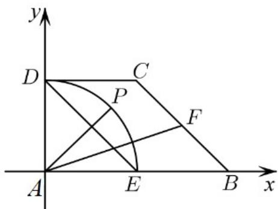

<!-- question-source:start -->
38. 在直角梯形 $ABCD$ 中， $AB \perp AD$ ， $DC \parallel AB$ ， $AD = DC = 1$ ， $AB = 2$ ， $E$ ， $F$ 分别为 $AB$ ， $BC$ 的中点，点 $P$ 在以 $A$ 为圆心的圆弧 $DE$ 上运动，若 $AP = xED + yAF$ ，求 $2x - y$ 的取值范围。

<!-- question-source:end -->

![[高中/课堂同步/题库/人教A版高中数学同步讲义(2026)/02_必修第二册/第六章 平面向量及其应用/专题02 平面向量基本定理及坐标表示六大常考题型（高效培优专项训练）/题型四_由向量线性运算解决最值和范围问题/questions/answers/Q00078306A1.md]]
