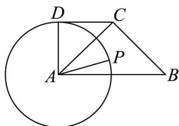
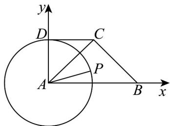

> [!faq]- 《专题02 平面向量基本定理及坐标表示六大常考题型（高效培优专项训练）》官方解析
>
> > [!success]- **【答案】** 
>
> > [!note]- **【解析】**
> > 以 A 为坐标原点，AB, AD 所在的直线分别为 x 轴，y 轴，建立平面直角坐标系，如图所示.
> >
> > 
> >
> > 所以 $B(2,0), C(1,1), A(0,0)$ ，设 $P(\cos \theta, \sin \theta)$
> >
> > 则 $AP = (\cos \theta, \sin \theta), AB = (2, 0), AC = (1, 1)$
> >
> > 所以 $AP = xAC + yAB = x(1,1) + y(2,0) = (x + 2y,x) = (\cos \theta \cdot \sin \theta)$
> >
> > 所以 $x + 2y = \cos \theta, x = \sin \theta$ 。所以 $x = \sin \theta, y = \frac{\cos \theta - \sin \theta}{2}$
> >
> > 所以 $3x + y = 3\sin\theta + \frac{\cos\theta - \sin\theta}{2} = \frac{5}{2}\sin\theta + \frac{1}{2}\cos\theta = \frac{\sqrt{26}}{2}\sin(\theta + \varphi)$ ,
> >
> > 其中 $\cos \varphi = \frac{5}{\sqrt{26}},\sin \varphi = \frac{1}{\sqrt{26}}$ ，所以 $(3x + y)_{\min} = -\frac{\sqrt{26}}{2}$
> >
> > 此时 $\sin (\theta +\varphi) = -1$ ，所以 $3x + y$ 的最小值为 $-\frac{\sqrt{26}}{2}$ .故答案为： $-\frac{\sqrt{26}}{2}$
