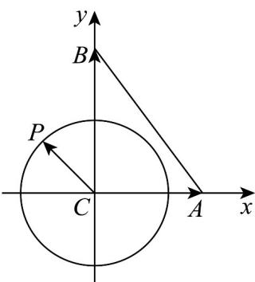

> [!faq]- 《专题02 平面向量基本定理及坐标表示六大常考题型（高效培优专项训练）》官方解析
>
> > [!success]- **【答案】** $\left[-\frac{5}{6},\frac{5}{6}\right]$
>
> > [!note]- **【解析】**
> > 如图建立平面直角坐标系，设 $P(2\cos \alpha ,2\sin \alpha)$ ，则 $A(3,0),B(0,4)$ 则 $\overline{CP} = (2\cos \alpha ,2\sin \alpha)$ ， $\lambda \overline{CA} +\mu \overline{CB} = \lambda (3,0) + \mu (0,4) = (3\lambda ,4\mu)$
> >
> > 因为 $\stackrel{\square\square\square}{CP} = \lambda \stackrel{\square\square\square}{CA} + \mu \stackrel{\square\square\square}{CB}$ ，所以 $\left\{ \begin{array}{l} 2\cos \alpha = 3\lambda \\ 2\sin \alpha = 4\mu \end{array} \right.$ ，即 $\left\{ \begin{array}{l} \lambda = \frac{2\cos \alpha}{3} \\ \mu = \frac{\sin \alpha}{2} \end{array} \right.$
> >
> > 所以 $\lambda +\mu = \frac{1}{2}\sin \alpha +\frac{2}{3}\cos \alpha = \sqrt{\frac{1}{4} + \frac{4}{9}}\sin (\alpha +\varphi) = \frac{5}{6}\sin (\alpha +\varphi)$ ， $\tan \varphi = \frac{4}{3}$
> >
> > 所以 $\lambda +\mu$ 的取值范围是 $\left[-\frac{5}{6},\frac{5}{6}\right]\cdot$ 故答案为： $\left[-\frac{5}{6},\frac{5}{6}\right]$
> >
> > 
