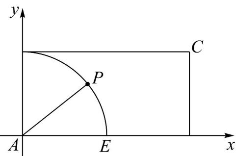

> [!faq]- 《专题02 平面向量基本定理及坐标表示六大常考题型（高效培优专项训练）》官方解析
>
> > [!success]- **【答案】** C
>
> > [!note]- **【解析】**
> > 构建如下直角坐标系： $AB = (0,1),\overline{AD} = (2,0)$ ，令 $AP = (\cos \theta ,\sin \theta)$ ， $\theta \in [0,2\pi)$
> >
> > 
> >
> > 由 $\overline{AP} = \lambda \overline{AB} +\mu \overline{AD}\big(\lambda ,\mu \in \mathbb{R}\big)$ 可得： $\begin{cases} \cos \theta = 2\mu \\ \sin \theta = \lambda \end{cases}$
> >
> > 则 $\lambda +\mu = \sin \theta +\frac{\cos\theta}{2} = \frac{\sqrt{5}}{2}\sin (\theta +\varphi)$ 且 $\tan \varphi = \frac{1}{2}$
> >
> > 所以当 $\sin(\theta+\varphi)=1$ 时， $\lambda+\mu$ 的最大值为 $\frac{\sqrt{5}}{2}$
> >
> > 故选 **C**
