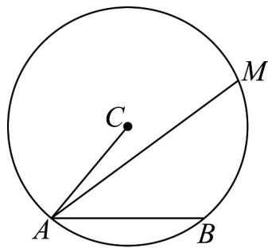
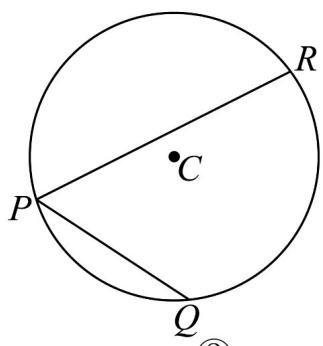

<!-- question-source:start -->
10. 如图，圆 $C$ 的半径为 2.

①

(1)设 $AB$ 为圆 $C$ 的一条弦，如图①，当 $\angle CAB = 60^{\circ}$ 时，

(i) 当 t 取何值时， $\left|AC-tAB\right|$ 取得最小值，并求出此最小值；

(ii) 设 $M$ 是圆 $C$ 上的一动点，求 $\overline{AM} \cdot \overline{AB}$ 的最大值；

(2)设 $PQ$ 、 $PR$ 为圆 $C$ 的两条弦，如图②，已知 $\angle QPR = 60^{\circ}$ ，求 $PQ \cdot PR$ 的最大值·
<!-- question-source:end -->

![[高中/课堂同步/题库/人教A版高中数学同步讲义(2026)/02_必修第二册/第六章 平面向量及其应用/专题03 平面向量的应用六大常考题型（高效培优专项训练）/题型一_平面几何中的向量方法/questions/answers/Q00078336A1.md]]
