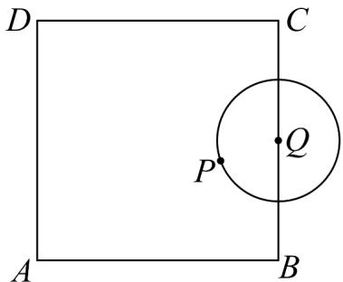
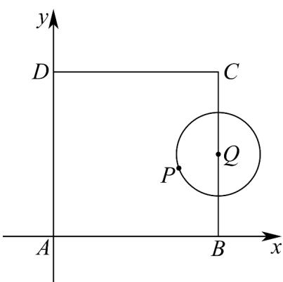
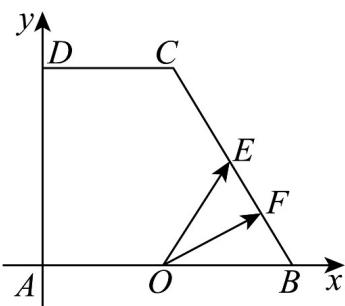
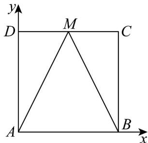

> [!faq]- 《专题03 平面向量的应用六大常考题型（高效培优专项训练）》官方解析
>
> > [!success]- **【答案】** 
>
> > [!note]- **【解析】**
> > 以 A 为原点建立直角坐标系，AB 方向为 x 轴正半轴，AD 方向为 y 轴正半轴，
> >
> > 
> >
> > 则 $A(0,0)$ ， $B(4,0)$ ， $D(0,4)$ ，则 $AB = (4,0)$ ， $AD = (0,4)$
> >
> > 设 $Q(4,b)$ （ $b\in [0,4]$ ），则圆 $Q$ 方程为 $\left(x - 4\right)^2 +\left(y - b\right)^2 = 1$
> >
> > 设 $P(4 + \cos \theta, b + \sin \theta)$ ，则 $AP = (4 + \cos \theta, b + \sin \theta)$
> >
> > $\overline{AP}=\lambda\overline{AD}+\mu\overline{AB}=\lambda(0,4)+\mu(4,0)=(4\mu,4\lambda)$
> >
> > 可得 $\mu=1+\frac{\cos\theta}{4}$ ， $\lambda=\frac{b}{4}+\frac{\sin\theta}{4}$ ，
> >
> > 所以 $\lambda + 2\mu = \frac{b}{4} + \frac{\sin\theta}{4} + 2 + \frac{\cos\theta}{2} = 2 + \frac{b}{4} + \frac{\sqrt{5}}{4}\sin(\theta + \varphi)$ ，其中 $\tan\varphi = 2$ ，
> >
> > 当 $b = 4$ ， $\sin (\theta +\varphi) = 1$ ， $\lambda +2\mu$ 取得最大值 $3 + \frac{\sqrt{5}}{4}$
> >
> > 当 $b = 0$ ， $\sin (\theta +\varphi) = -1$ ， $\lambda +2\mu$ 取得最小值 $2 - \frac{\sqrt{5}}{4}$
> >
> > 所以 $\lambda + 2\mu$ 的取值范围为 $\left[2 - \frac{\sqrt{5}}{4}, 3 + \frac{\sqrt{5}}{4}\right]$ . 故答案为： $\left[2 - \frac{\sqrt{5}}{4}, 3 + \frac{\sqrt{5}}{4}\right]$ .
> >
> > 3．直角梯形中， $AB = BC = 2$ ， $AD = \sqrt{3}$ ， $CD = 1$ ，点 $O$ ， $E$ 为 $AB,BC$ 的中点， $F$ 在 $BC$ 边上运动（包含端点），则 $\overline{OE} \cdot \overline{OF}$ 的取值范围为
> >
> > 【答案】 $\left[\frac{1}{2},\frac{3}{2}\right]$
> >
> > 【详解】
> >
> > 
> >
> > 建立平面直角坐标系如图，则 $A(0,0)$ ， $B(2,0)$ ， $C(1,\sqrt{3})$ ， $D(0,\sqrt{3})$
> >
> > 点 $O$ ， $E$ 为 $AB,BC$ 的中点， $\therefore O(1,0)$ ， $E\left(\frac{3}{2},\frac{\sqrt{3}}{2}\right)$
> >
> > $\therefore \overrightarrow{OE} = \left(\frac{1}{2}, \frac{\sqrt{3}}{2}\right), \overrightarrow{BC} = (-1, \sqrt{3}), \overrightarrow{OB} = (1, 0)$
> >
> > $\because F$ 在 $BC$ 边上运动（包含端点），设 $\overline{BF} = \lambda \overline{BC}\left(0\leq \lambda \leq 1\right)$
> >
> > $$
> > \therefore \stackrel {{\sqcup \sqcup \sqcup}} {B F} = (- \lambda , \sqrt {3} \lambda), \therefore O F = O B + B F = (1, 0) + (- \lambda , \sqrt {3} \lambda) = (1 - \lambda , \sqrt {3} \lambda)
> > $$
> >
> > $$
> > \therefore \overrightarrow {O E} \cdot \overrightarrow {O F} = \frac {1}{2} (1 - \lambda) + \frac {\sqrt {3}}{2} \times \sqrt {3} \lambda = \lambda + \frac {1}{2}
> > $$
> >
> > $$
> > \because 0 \leq \lambda \leq 1, \therefore \frac {1}{2} \leq \lambda + \frac {1}{2} \leq \frac {3}{2}
> > $$
> >
> > ∴ $OE \cdot OF$ 的取值范围为 $\left[\frac{1}{2}, \frac{3}{2}\right]$ ·故答案为： $\left[\frac{1}{2}, \frac{3}{2}\right]$ ·
> >
> > 4．四边形ABCD是边长为1的正方形，M是线段CD上的动点（包括端点C、D），则（）
> >
> > 【答案】
> >
> > A. $AM \cdot BC = 1$ B. 当 $AD + MC = AM$ 时，M 为 CD 中点
> > C. $\left|\begin{matrix}U & U \\ MA & MB\end{matrix}\right|$ 的最小值为 $\sqrt{3}$ D. $\left|\begin{matrix}U & U \\ MA & MB\end{matrix}\right|$ 的最大值为 $\sqrt{5}$
> >
> > 【答案】ABD
> >
> > 【详解】以 A 为原点，分别以 AB ， AD 所在直线为 x ， y 轴建立平面直角坐标系，
> >
> > 
> >
> > 因为四边形 $ABCD$ 是边长为 $^{1}$ 的正方形， $M$ 是线段 $CD$ 上的动点（包括端点 $C$ 、 $D$ ）则 $A(0,0)$ ， $B(1,0)$ ， $C(1,1)$ ， $D(0,1)$ ，设 $M(x,1)$ ( $0 \leq x \leq 1$ )，对于 $A$ ， $\overline{AM} = (x,1)$ ， $\overline{BC} = (0,1)$ ，所以 $\overline{AM} \cdot \overline{BC} = 1$ ，故 $^{A}$ 选项正确；对于 $^{B}$ ， $\overline{AD} = (0,1)$ ， $\overline{MC} = (1 - x,0)$ ， $\overline{AM} = (x,1)$ ，由于 $\overline{AD} + \overline{MC} = \overline{AM}$ ，所以 $1 - x = x$ ，解得 $x = \frac{1}{2}$ ，则 $M$ 为 $CD$ 中点，故 $^{B}$ 选项正确；对于 $^{C}$ ， $\overline{MA} = (-x,-1)$ ， $\overline{MB} = (1-x,-1)$ ，则 $\overline{MA} + \overline{MB} = (1-2x,-2)$ ，所以 $\left|\overline{MA} + \overline{MB}\right| = \sqrt{(1-2x)^2+4}$ ，则当 $x = \frac{1}{2}$ 时， $\left|\overline{MA} + \overline{MB}\right|$ 的最小值为 $^{2}$ ，故 $^{C}$ 选项不正确；对于 $^{D}$ ，当 $x = 0$ 或 1 时， $\left|\overline{MA} + \overline{MB}\right|$ 的最大值为 $\sqrt{5}$ ，故 $^{D}$ 选项正确；
> >
> > 故选 **ABD**
