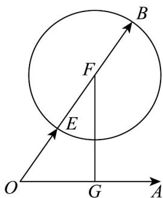

> [!faq]- 《专题03 平面向量的应用六大常考题型（高效培优专项训练）》官方解析
>
> > [!success]- **【答案】** A. 1 B. $\sqrt{3}$ C. $\sqrt{3} - 1$ D. $\sqrt{3} + 1$
>
> > [!note]- **【解析】**
> > 如图，设 $OA = a$ ， $OB = b$ ， $OE = e$ ， $OF = 2e$
> >
> > 
> >
> > 由 $b^{2}-4e\cdot b+3=0$ 得 $\left(b-2\vec{e}\right)^{2}=1$ ，即 $\left|\overrightarrow{BF}\right|=1$ ，
> >
> > 所以点 B 在以 F 为圆心， $^{1}$ 为半径的圆上，
> >
> > 过点 $F$ 作 $OA$ 的垂线，垂足为 $G$ ，又 $\left|OF\right| = 2$ ， $\angle FOG = \frac{\pi}{3}$ 则 $\left|FG\right| = \sqrt{3}$
> >
> > 所以 $\left|a-b\right|=\left|AB\right|$ 的最小值为 $\left|FG\right|-1=\sqrt{3}-1$
> >
> > 故选 **C**.
