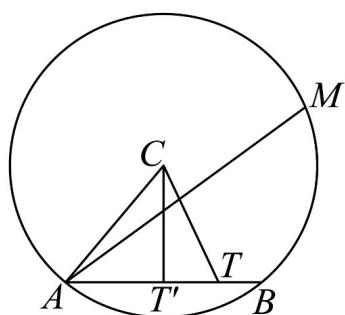
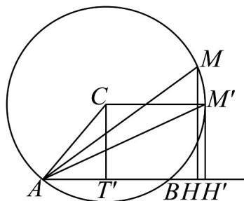
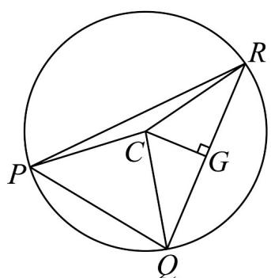

> [!faq]- 《专题03 平面向量的应用六大常考题型（高效培优专项训练）》官方解析
>
> > [!success]- **【答案】** (1) (i) 当 $t=\frac{1}{2}$ 时， $\left|AC-tAB\right|$ 取得最小值，最小值为 $\sqrt{3}$ ; (ii) 6; (2) 6.
>
> > [!note]- **【解析】**
> > （1）（i）设 $\overline{AT} = t\overline{AB}$ ，即有T为直线AB上某一点，
> >
> > $$
> > A C - t A B = A C - A T = T C
> > $$
> >
> > 要使 $\left|AC-tAB\right|$ 取得最小值，即 $\left|TC\right|$ 最小，则此时只需 $TC\perp AB$ ，
> >
> > 过点 C 作 $CT' \perp AB$ 于点 $T'$ ，有 $AT' = \frac{1}{2} AB$ ，即 $t = \frac{1}{2}$ ，
> >
> > 而因为 $\angle CAB = 60^{\circ}$ ，因此 $CT' = \frac{\sqrt{3}}{2} \times 2 = \sqrt{3}$
> >
> > 故当 $t = \frac{1}{2}$ 时， $\left| \overline{AC} - t \overline{AB} \right|$ 取得最小值，其最小值为 $\sqrt{3}$ .
> >
> > 
> >
> > （ii）因为 $\angle CAB = 60^{\circ}$ ， $\left|\overrightarrow{AB}\right| = 2\left|\overrightarrow{AT'}\right| = 2\times \left(\frac{1}{2}\times 2\right) = 2$
> >
> > 过点 M 作 $MH \perp AB$ 于点 H， $AM = AH + HM$
> >
> > $$
> > \stackrel {\square \square \square \square} {A M} \cdot \stackrel {\square \square \square} {A B} = \left(\stackrel {\square \square \square} {A H} + \stackrel {\square \square \square \square} {H M}\right) \cdot \stackrel {\square \square \square} {A B} = \stackrel {\square \square \square} {A H} \cdot \stackrel {\square \square \square} {A B} + \stackrel {\square \square \square \square} {H M} \cdot \stackrel {\square \square \square} {A B} = \stackrel {\square \square \square} {A H} \cdot \stackrel {\square \square \square} {A B}
> > $$
> >
> > 而 $AH \cdot AB = \left|AH\right| \cdot \left|AB\right|$ 或 $AH \cdot AB = -\left|AH\right| \cdot \left|AB\right|$
> >
> > 要使 $\overline{AM} \cdot \overline{AB}$ 的最大，则需 $\overline{AH}$ ， $\overline{AB}$ 同向，且 $\left| \overline{AH} \right|$ 最大，此时 $MH$ 与圆 $C$ 相切，
> >
> > 平移 AB 的垂线 MH 至 $M'H'$ ，使 $M'H'$ 圆 C 相切，
> >
> > 此时有 $CM' \perp M'H'$ ， $AB \parallel CM'$ ，所以 $AH_{\max} = AT' + CM' = 1 + 2 = 3$ ，
> >
> > $$
> > \left(\stackrel {\sqcup \sqcup \sqcup} {A M} \cdot \stackrel {\sqcup \sqcup \sqcup} {A B}\right) _ {\max} = \left| \stackrel {\sqcup \sqcup \sqcup} {A H} \right| _ {\max} \cdot \left| \stackrel {\sqcup \sqcup \sqcup} {A B} \right| = \left| \stackrel {\sqcup \sqcup \sqcup} {A H ^ {\prime}} \right| \cdot \left| \stackrel {\sqcup \sqcup \sqcup} {A B} \right| = 3 \times 2 = 6.
> > $$
> >
> > 
> >
> > (2) 过点 C 作 $CG \perp QR$ 于点 G，
> >
> > $$
> > \stackrel {\text {   }} {P Q} = \stackrel {\text {   }} {P C} + \stackrel {\text {   }} {C G} + \stackrel {\text {   }} {G Q}, \stackrel {\text {   }} {P R} = \stackrel {\text {   }} {P C} + \stackrel {\text {   }} {C G} + \stackrel {\text {   }} {G R}, \text {而} \stackrel {\text {   }} {G R} = - \stackrel {\text {   }} {G Q}
> > $$
> >
> > 所以 $PQ \cdot PR = \left(PC + CG + GQ\right) \cdot \left(PC + CG + GR\right) = \left(PC + CG + GQ\right) \cdot \left(PC + CG - GQ\right)$
> >
> > $$
> > = \stackrel {\text {UUU}} {P C} ^ {2} + \stackrel {\text {UUU}} {C G} ^ {2} + 2 P C \cdot \stackrel {\text {UUU}} {C G} - \stackrel {\text {UUU}} {G Q} ^ {2} = \left| \stackrel {\text {UUU}} {P C} \right| ^ {2} + \left| \stackrel {\text {UUU}} {C G} \right| ^ {2} + 2 P C \cdot \stackrel {\text {UUU}} {C G} - \left| \stackrel {\text {UUU}} {G Q} \right| ^ {2}
> > $$
> >
> > 因为 $\angle QPR = 60^{\circ}$ ，所以 $\angle QCR = 120^{\circ}$ ， $\angle CQR = \angle CRQ = 30^{\circ}$ ， $CG = \frac{1}{2} CQ = 1$ ， $GQ = GR = \frac{\sqrt{3}}{2} CQ = \sqrt{3}$
> >
> > 所以 $PQ \cdot PR = \left|PC\right|^{2} + \left|CG\right|^{2} + 2PC \cdot CG - \left|GQ\right|^{2} = 4 + 1 + 2PC \cdot CG - 3 = 2 + 2PC \cdot CG$
> >
> > 因此，当 $PC$ ， $CG$ 共线时， $PQ\cdot PR$ 取得最大值， $\left( \begin{array}{cc}\text{UUU} & \text{UUU} \\ PQ\cdot PR \end{array} \right)_{\max} = 2 + 2\left|PC\right|\cdot \left|CG\right| = 2 + 2\times 2\times 1 = 6.$
> >
> > 
