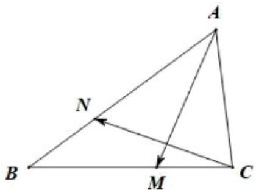

<!-- question-source:start -->
20. 如图，在 $\triangle ABC$ 中，已知 $\angle A = 60^{\circ}$ ， $AC = 1$ ， $AB = 2$ ， $M, N$ 分别是线段 $BC, AB$ 上两点，且满足 $CM = \lambda CB$ ， $BN = \lambda BA(0 < \lambda < 1)$ .

(1)若 $\lambda = \frac{1}{2}$ ，求 $\left|AM\right|$ 及 $AM \cdot BC$ 的值；

(2)若 $AM \perp CN$ ，求 $\lambda$ 的值·
<!-- question-source:end -->

![[高中/课堂同步/题库/人教A版高中数学同步讲义(2026)/02_必修第二册/第六章 平面向量及其应用/专题03 平面向量的应用六大常考题型（高效培优专项训练）/题型二_正余弦定理解三角形/questions/answers/Q00078345A1.md]]
