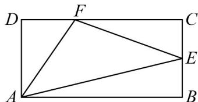

> [!faq]- 《专题03 平面向量的应用六大常考题型（高效培优专项训练）》官方解析
>
> > [!success]- **【答案】** C
>
> > [!note]- **【解析】**
> > ∵ 在矩形 ABCD, AB = 3, AD = 2， $BE = EC, CF = 2FD$ ，∴ E 为 BC 中点，F 为靠近 D 的三等分点，则 DF = 1, CF = 2，
> >
> > 如图所示，
> >
> > 
> >
> > 则 $AE = \sqrt{AB^{2} + BE^{2}} = \sqrt{9 + 1} = \sqrt{10}$ ， $AF = \sqrt{AD^{2} + DF^{2}} = \sqrt{4 + 1} = \sqrt{5}$ ， $EF = \sqrt{CF^{2} + CE^{2}} = \sqrt{4 + 1} = \sqrt{5}$ ，
> > 在 $\triangle AEF$ 中，利用余弦定理可得， $\cos\angle AEF=\frac{AE^{2}+EF^{2}-AF^{2}}{2\cdot AE\cdot EF}=\frac{5+10-5}{2\cdot\sqrt{5}\cdot\sqrt{10}}=\frac{\sqrt{2}}{2}$ ∴ $\angle AEF = \frac{\pi}{4}$ .
> >
> > 故选：C.
> >
> > 12. VABC 的内角 A, B, C 的对边分别为 a, b, c，已知 a = 3，c = 1， $\cos(A + C) = -\frac{1}{2}$ ，则 b = \_\_\_\_。
> > 【答案】 $\sqrt{7}$ 【详解】因为 $\cos(A+C)=\cos(\pi-B)=-\cos B=-\frac{1}{2}$ 所以 $\cos B=\frac{1}{2}$ 又 a=3, c=1，
> > 则 $\cos B=\frac{a^{2}+c^{2}-b^{2}}{2ac}=\frac{9+1-b^{2}}{6}=\frac{1}{2}$ 所以 $b^{2}=7$ ，即 $b=\sqrt{7}$ ，
> >
> > 故答案为： $\sqrt{7}$
