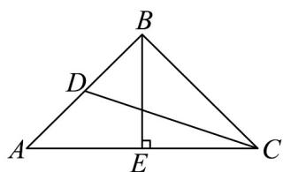

> [!faq]- 《专题03 平面向量的应用六大常考题型（高效培优专项训练）》官方解析
>
> > [!success]- **【答案】** C
>
> > [!note]- **【解析】**
> > 如图所示，作 $BE \perp AC$
> >
> > 
> >
> > 在VABC中，由平面向量的加法法则得 $BA+\lambda A\Phi$ 的最小值为点B到AC的距离，即BE=2，
> > 又 $AB = BC = 2\sqrt{2}$ ，所以 AE = EC = 2，VABC 为等腰直角三角形，
> >
> > 又因为 $\overline{BP} = \sin^2\theta \overline{BA} +\cos^2\theta BC$ ， $\sin^2\theta +\cos^2\theta = 1$ ， $\sin^2\theta$ 0， $\cos^2\theta$ 0，
> >
> > 所以点 $P$ 在线段 $AC$ 上，所以 $\overrightarrow{DP}$ 的最大值即为 $CD$ 的长，
> >
> > 在 $\triangle ADC$ 中， $A = \frac{\pi}{4}$ ，由 $AD = DB$ 知 $AD = \frac{1}{2} AB = \sqrt{2}$
> >
> > $CD^{2}=AD^{2}+AC^{2}-2AD\cdot AC\cdot\cos A=\left(\sqrt{2}\right)^{2}+4^{2}-2\times\sqrt{2}\times4\times\frac{\sqrt{2}}{2}=10$ ，即 $CD=\sqrt{10}$ ，
> > 所以 $\stackrel{\square\square\square}{DP}$ 的最大值为 $\sqrt{10}$ .
> >
> > 故选 **C**.
