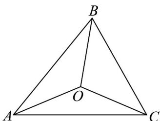

> [!faq]- 《专题03 平面向量的应用六大常考题型（高效培优专项训练）》官方解析
>
> > [!success]- **【答案】** A. $A=\frac{\pi}{6}$ B. $\frac{\cos\angle OAB}{\cos\angle OAC}=\frac{3}{2}$ C. $\overline{CB}\cdot\overline{AO}=10$ D. $\lambda\mu=\frac{2}{9}$
>
> > [!note]- **【解析】**
> > 对于 A，由余弦定理得 $\cos A = \frac{b^{2} + c^{2} - a^{2}}{2bc} = \frac{16 + 36 - 28}{2 \times 4 \times 6} = \frac{1}{2}$ ，又 $A \in (0, \pi)$ ，故 $A = \frac{\pi}{3}$ ，A 选项错误；
> > 对于 B，设 VABC 的外接圆半径为 r，由于点 O 为 VABC 的外接圆圆心，
> > 故 OA = OB = OC = r $\cos\angle OAB=\frac{OA^{2}+AB^{2}-OB^{2}}{2OA\cdot AB}=\frac{r^{2}+c^{2}-r^{2}}{2r\cdot c}=\frac{c}{2r}$ $\cos\angle OAC=\frac{OA^{2}+AC^{2}-OC^{2}}{2OA\cdot AC}=\frac{r^{2}+b^{2}-r^{2}}{2r\cdot b}=\frac{b}{2r}$ 所以 $\frac{\cos\angle OAB}{\cos\angle OAC}=\frac{\frac{c}{2r}}{\frac{b}{2r}}=\frac{c}{b}=\frac{3}{2}$ ，B 选项正确；
> > 对于 C 选项，由于 $CB=AB-AC$ 由向量数量积的几何意义得：
> > AO 在 AB 上的投影向量为 $\frac{1}{2}AB$ ， $AB \cdot AO = \frac{1}{2}AB \cdot AB = \frac{1}{2}AB^{2} = \frac{1}{2}c^{2} = 18$ 同理 $AC \cdot AO = \frac{1}{2}AC \cdot AC = \frac{1}{2}AC^{2} = \frac{1}{2}b^{2} = 8$ 故 $CB \cdot AO = (AB - AC) \cdot AO = AB \cdot AO - AC \cdot AO = 18 - 8 = 10$ ，故 C 选项正确；
> >
> > 
> >
> > 对于 D，因为 $\overline{AC} \cdot \overline{AB} = \left| \overline{AC} \right| \cdot \left| \overline{AB} \right| \cos A = 4 \times 6 \times \frac{1}{2} = 12$
> >
> > 由于 $AC \cdot AO = AC \cdot (\lambda AB + \mu AC) = \lambda AC \cdot AB + \mu AC^{2} = 12\lambda + 16\mu = 8$
> >
> > 即 $3\lambda + 4\mu = 2$
> >
> > 由于 $AB \cdot AO = AB \cdot (\lambda AB + \mu AC) = \mu AC \cdot AB + \lambda AB^2 = 12\mu + 36\lambda = 18$
> >
> > 即 $2\mu + 6\lambda = 3$
> >
> > 所以 $\left\{\begin{aligned}3\lambda+4\mu=2\\ 6\lambda+2\mu=3\end{aligned}\right.$ ，解得 $\lambda=\frac{4}{9}$ ， $\mu=\frac{1}{6}$ .
> >
> > 所以 $\lambda\mu=\frac{4}{9}\times\frac{1}{6}=\frac{2}{27}$ ，故 D 选项错误；
> >
> > 故选 **BC**
