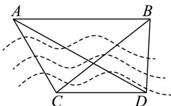

> [!faq]- 《专题03 平面向量的应用六大常考题型（高效培优专项训练）》官方解析
>
> > [!success]- **【答案】**  A. $10\sqrt{6}\mathrm{km}$ B. $30(\sqrt{3} -1)\mathrm{km}$ C. $15\mathrm{km}$ D. $10\sqrt{5}\mathrm{km}$
>
> > [!note]- **【解析】**
> > 在 $\triangle ACD$ 中， $\angle CAD = 180^{\circ} - 105^{\circ} - 30^{\circ} = 45^{\circ}$
> >
> > 由正弦定理 $\frac{AC}{\sin 30^{\circ}} = \frac{CD}{\sin 45^{\circ}}$ ，即 $\frac{\frac{AC}{1}}{\frac{2}{2}} = \frac{20}{\frac{\sqrt{2}}{2}}$ ，得 $AC = 10\sqrt{2}$ km.
> >
> > 在 $\triangle BCD$ 中， $\angle BCD = 105^{\circ} - 60^{\circ} = 45^{\circ}$ ， $\angle BDC = 30^{\circ} + 60^{\circ} = 90^{\circ}$ ，故 $\angle CBD = 45^{\circ}$
> >
> > 由正弦定理 $\frac{BC}{\sin 90^{\circ}} = \frac{CD}{\sin 45^{\circ}}$ ，即 $\frac{BC}{1} = \frac{20}{\frac{\sqrt{2}}{2}}$ ，得 $BC = 20\sqrt{2}$ km.
> >
> > 在 $\triangle ACB$ 中，由余弦定理 $AB^{2} = AC^{2} + BC^{2} - 2\cdot AC\cdot BC\cdot \cos 60^{\circ}$
> >
> > 代入得 $AB^{2}=\left(10\sqrt{2}\right)^{2}+\left(20\sqrt{2}\right)^{2}-2\times10\sqrt{2}\times20\sqrt{2}\times\frac{1}{2}=600$ ，故 $AB=10\sqrt{6}$ km.
> >
> > 故选 **A**
