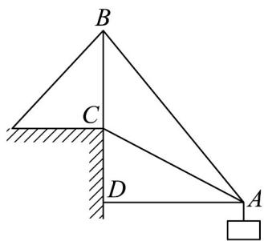

<!-- question-source:start -->
42. 如图所示为起重机装置示意图，支杆 $BC = 10\mathrm{m}$ ，吊杆 $AC = 15\mathrm{m}$ ，吊索 $AB = 5\sqrt{19}\mathrm{m}$ ，起吊的货物与岸的距离 $AD$ 为 \_\_\_\_ m.

<!-- question-source:end -->

![[高中/课堂同步/题库/人教A版高中数学同步讲义(2026)/02_必修第二册/第六章 平面向量及其应用/专题03 平面向量的应用六大常考题型（高效培优专项训练）/题型五_距离_高度_角度问题/questions/answers/Q00078365A1.md]]
