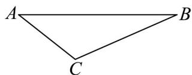

> [!faq]- 《专题03 平面向量的应用六大常考题型（高效培优专项训练）》官方解析
>
> > [!success]- **【答案】** D
>
> > [!note]- **【解析】**
> > 设出发点为 A，向东航行到 B 处后改变航向到达 C
> >
> > 
> >
> > 则 $AB = x$ ， $AC = 30$ ， $BC = 30\sqrt{3}$ ， $\angle ABC = 30^{\circ}$
> >
> > 由正弦定理可得： $\frac{AC}{\sin\angle ABC} = \frac{BC}{\sin\angle BAC}$ ，即 $\frac{30}{\sin 30^{\circ}} = \frac{30\sqrt{3}}{\sin\angle BAC}$
> >
> > $$
> > \therefore \sin \angle B A C = \frac {\sqrt {3}}{2}
> > $$
> >
> > $$
> > \therefore \angle B A C = 6 0 ^ {\circ} \text {或} 1 2 0 ^ {\circ}
> > $$
> >
> > (1) 若 $\angle BAC = 60^{\circ}$ ，则 $\angle ACB = 90^{\circ}$ ，VABC为直角三角形，
> >
> > $\therefore AB = 2AC = 60$
> >
> > (2) 若 $\angle BAC = 120^{\circ}$ ，则 $\angle ACB = 30^{\circ}$ ，VABC 为等腰三角形，
> >
> > $$
> > \therefore A B = A C = 3 0
> > $$
> >
> > 综上，x 的值为 30 或 60.
> >
> > 故选 **D**.
