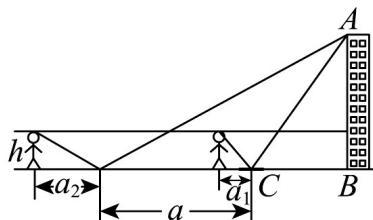
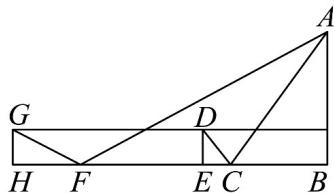

> [!faq]- 《专题03 平面向量的应用六大常考题型（高效培优专项训练）》官方解析
>
> > [!success]- **【答案】** (1) $20 \sqrt{3}$ (2) $\frac{5\sqrt{2}}{8}$
>
> > [!note]- **【解析】**
> > （1）在 $\triangle DBC$ 中，由正弦定理可得 $\frac{DC}{\sin\angle DBC} = \frac{BD}{\sin\angle DCB}$
> >
> > 因为 $\sqrt{3}\sin\angle DBC=\sin\angle DCB$ ，所以 $BD=\sqrt{3}DC$ 。
> >
> > 又 DC 两处相距 20 米，故 $BD = \sqrt{3}DC = 20\sqrt{3}$ ，所以 BD 的长为 $20\sqrt{3}$ 米.
> >
> > (2) 在 Rt△ ADB 中，由在 D 处测得树干顶端 A 处的仰角为 $30^{\circ}$
> >
> > 可得 $\frac{AB}{BD} = \tan 30^{\circ} = \frac{\sqrt{3}}{3}$ ，则 $AB = 20\sqrt{3} \times \frac{\sqrt{3}}{3} = 20$
> >
> > 由（1）知 $BD = 20\sqrt{3}$ ，由 $\sqrt{3} BC = BD$ ，得 $BC = \frac{BD}{\sqrt{3}} = 20$
> >
> > 由 $BD = DA \cos 30^{\circ}$ ，得 $AD = \frac{BD}{\cos 30^{\circ}} = \frac{20\sqrt{3}}{\frac{\sqrt{3}}{2}} = 40$
> >
> > 在 $\mathrm{Rt}^{\triangle} ABC$ 中，由 $AB = BC = 20$ ，得 $AC = \sqrt{AB^2 + BC^2} = 20\sqrt{2}$
> >
> > 在 $\triangle DAC$ 中，由余弦定理得 $\cos \angle DAC = \frac{AD^2 + AC^2 - DC^2}{2AD\cdot AC} = \frac{40^2 + (20\sqrt{2})^2 - 20^2}{2\times 40\times 20\sqrt{2}} = \frac{5\sqrt{2}}{8}$
> >
> > 故在 $A$ 处观测到 $C$ 、 $D$ 两点的夹角 $\angle DAC$ 的余弦值为 $\frac{5\sqrt{2}}{8}$
> >
> > 50. 镜面反射法是测量建筑物高度的重要方法，在如图所示的测量建筑物 $AB$ 的模型中，已知人眼距离地面高度 $h = 1.6\mathrm{m}$ ，将镜子（平面镜）中心置于平地 $C$ 点处，人后退至从镜中能够看到建筑物的位置，测量人与镜子的距离 $a_1 = 1.2\mathrm{m}$ ，将镜子后移 $a = 10\mathrm{m}$ ，重复前面中的操作，则测量人与镜子的距离 $a_2 = 3.2\mathrm{m}$ ，则下列说法正确的是（）
> >
> > 【答案】
> >
> > 
> >
> > A $BC = 6\mathrm{m}$
> >
> > B $AB = 8\mathrm{m}$
> >
> > C. 若仅 $h$ 的测量值偏大（其它测量值准确），则计算出的建筑物高度 $AB$ 值会减小 D. 记先后两次测量中，人看镜中建筑顶端的视线与水平线夹角依次为 $\alpha$ 、 $\beta$ 则 $\frac{\tan \alpha}{\tan \beta} = \frac{a_2}{a_1}$
> >
> > 【答案】ABD
> >
> > 【详解】作出图形如图所示，
> >
> > 
> >
> > 由题意可知， $GH = DE = h, HF = a_{2}, FC = a, EC = a_{1}$
> >
> > 易知 $\triangle GHF\sim \triangle ABF,\triangle DEC\sim \triangle ABC$
> >
> > 设 $BC = x$ ，则 $\frac{h}{a_2} = \frac{AB}{a + x},\frac{h}{a_1} = \frac{AB}{x}$
> >
> > 化简得 $x=\frac{aa_{1}}{a_{2}-a_{1}}=\frac{10\times1.2}{3.2-1.2}=6m, AB=\frac{h}{a_{1}}\times x=\frac{ha}{a_{2}-a_{1}}=\frac{1.6\times10}{3.2-1.2}=8m$
> >
> > 所以 A,B 正确，
> >
> > 因为 $AB = \frac{hx}{a_{1}} = \frac{x}{a_{1}}h$ ， $x, a_{1}$ 不变，所以若仅 h 的测量值偏大（其它测量值准确），
> >
> > 则计算出的建筑物高度 AB 值会增大，故 $^{C}$ 错误；
> >
> > 因为 $\tan \alpha = \frac{AB - h}{x + a_1},\tan \beta = \frac{AB - h}{x + 10 + a_2}$ ，所以 $\frac{\tan\alpha}{\tan\beta} = \frac{x + 10 + a_2}{x + a_1} = \frac{6 + 10 + 3.2}{6 + 1.2} = \frac{8}{3}$ ，又 $\frac{a_2}{a_1} = \frac{3.2}{1.2} = \frac{8}{3}$
> >
> > 所以 $\frac{\tan\alpha}{\tan\beta}=\frac{a_{2}}{a_{1}}$ ，故 D 正确.
> >
> > 故选 **ABD**
