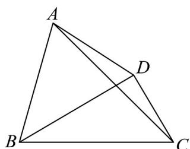

<!-- question-source:start -->
59. 已知锐角 $VABC$ 的内角 $A, B, C$ 所对的边分别为 $a, b, c$ ，且 $b^2 + c^2 = a^2 + bc$

(1)求 $A$ ；

(2)若 $c = 4$ ，求VABC的面积的取值范围；

(3)如图，若 $D$ 为VABC外一点，且 $\angle ABD = \angle ACB = \frac{\pi}{4}, BD \perp CD, AD = \sqrt{15}$ ，求 $a$ 。
<!-- question-source:end -->

![[高中/课堂同步/题库/人教A版高中数学同步讲义(2026)/02_必修第二册/第六章 平面向量及其应用/专题03 平面向量的应用六大常考题型（高效培优专项训练）/题型六_三角形边长_面积_周长最值与范围问题/questions/answers/Q00078375A1.md]]
