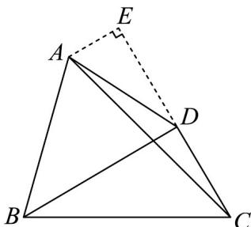

> [!faq]- 《专题03 平面向量的应用六大常考题型（高效培优专项训练）》官方解析
>
> > [!success]- **【答案】** (1) $A = \frac{\pi}{3}$ (2) $(2\sqrt{3}, 8\sqrt{3})$ (3) $a = 6$
>
> > [!note]- **【解析】**
> > （1）因为 $b^{2} + c^{2} = a^{2} + bc$ ，所以 $b^{2} + c^{2} - a^{2} = bc$
> >
> > 由余弦定理得 $\cos A = \frac{b^{2} + c^{2} - a^{2}}{2bc} = \frac{bc}{2bc} = \frac{1}{2}$
> >
> > 因为 $A \in (0, \pi)$ ，所以 $A = \frac{\pi}{3}$ ;
> >
> > (2)
> > 解法一：在 VABC 中，由正弦定理得 $\frac{b}{\sin B} = \frac{c}{\sin C}$
> >
> > 又 $c = 4, A = \frac{\pi}{3}$ ，所以 $b = \frac{c \sin B}{\sin C} = \frac{c \sin \left(\frac{2\pi}{3} - C\right)}{\sin C} = \frac{4\left(\sin \frac{2\pi}{3} \cos C - \cos \frac{2\pi}{3} \sin C\right)}{\sin C} = \frac{2\sqrt{3}}{\tan C} + 2$ ，
> >
> > 因为 VABC 是锐角三角形，所以 $C \in \left( \frac{\pi}{6}, \frac{\pi}{2} \right)$ ，所以 $\tan C \in \left( \frac{\sqrt{3}}{3}, +\infty \right)$ ，所以 $b \in (2,8)$ ，
> >
> > 因为 $S_{\triangle ABC} = \frac{1}{2} bc\sin A = \frac{1}{2} b\times 4\sin \frac{\pi}{3} = \sqrt{3} b$ ，所以VABC的面积的取值范围是 $\left(2\sqrt{3},8\sqrt{3}\right)$
> >
> > $$
> > \mathrm{V} A B C
> > $$
> >
> > 所以 $\cos B = \frac{c^2 + a^2 - b^2}{2ca} > 0$ ，且 $\cos C = \frac{a^2 + b^2 - c^2}{2ab} > 0$
> >
> > 所以 $c^2 + a^2 - b^2 > 0$ ，且 $a^2 + b^2 - c^2 > 0$
> >
> > 又因为 $a^{2}=b^{2}+c^{2}-bc,c=4$ ，所以 $a^{2}=b^{2}-4b+16$ ，
> >
> > 所以 $16 + b^{2} - 4b + 16 - b^{2} > 0$ ，且 $b^{2} - 4b + 16 + b^{2} - 16 > 0$ ，解得 $2 < b < 8$
> >
> > 因为 $S_{\triangle ABC} = \frac{1}{2}bc \sin A = \frac{1}{2}b \times 4 \sin \frac{\pi}{3} = \sqrt{3}b$ ，
> >
> > 所以VABC的面积的取值范围是 $\left(2\sqrt{3},8\sqrt{3}\right)$ ;
> >
> > 解法三：因为 $\mathrm{V}ABC$ 是锐角三角形，所以 $\angle ABC, \angle ACB$ 均为锐角，
> >
> > 根据图形变化，考查 $\angle ABC, \angle ACB$ 的极端位置情况，
> >
> > 当 $\angle ABC = \frac{\pi}{2}$ 时， $b = \frac{c}{\cos\frac{\pi}{3}} = 8$
> >
> > <!-- source-part:2 pages:51-53 -->
> >
> > 当 $\angle ACB = \frac{\pi}{2}$ 时， $b = c \cdot \cos \frac{\pi}{3} = 2$
> >
> > 可得当且仅当 $2 < b < 8$ 时，VABC是锐角三角形；
> >
> > 因为 $S_{\triangle ABC} = \frac{1}{2} bc\sin A = \frac{1}{2}\times b\times 4\times \sin \frac{\pi}{3} = \sqrt{3} b$
> >
> > 所以VABC的面积的取值范围是 $\left(2\sqrt{3},8\sqrt{3}\right)$ ;
> >
> > （3）
> > 解法一：因为 $A = \frac{\pi}{3},\angle ABD = \angle ACB = \frac{\pi}{4}$ ，所以 $\angle CBD = \pi -\left(\frac{\pi}{4} +\frac{\pi}{4} +\frac{\pi}{3}\right) = \frac{\pi}{6}$
> >
> > 因为 $BD \perp CD$ ，设 $CD = x$ ，则 $BC = a = 2x, BD = \sqrt{3} x$
> >
> > 在 VABC 中，由正弦定理可得 $\frac{AB}{\sin\frac{\pi}{4}}=\frac{BC}{\sin\frac{\pi}{3}}$ ，即 $AB=\frac{BC\sin\frac{\pi}{4}}{\sin\frac{\pi}{3}}=\frac{2\sqrt{6}}{3}x$ ①，
> >
> > 在 $\triangle ABD$ 中，由余弦定理可得 $AD^{2} = AB^{2} + BD^{2} - 2AB\cdot BD\cos \frac{\pi}{4}$ ②
> >
> > 将①式代入②式得 $\frac{8}{3}x^{2}+3x^{2}-2\times\frac{2\sqrt{6}}{3}x\times\sqrt{3}x\times\frac{\sqrt{2}}{2}=15$ ，
> >
> > 化简得 $x^{2} = 9$ ，解得 $x = 3$ ，故 $a = 6$
> >
> > 解法二：过点 A 作 $AE \perp DE$ 交 DC 的延长线于点 E，
> >
> > 
> >
> > 因为 $A=\frac{\pi}{3}$ ， $\angle ABD=\angle ACB=\frac{\pi}{4}$ ，所以 $\angle CBD=\pi-\left(\frac{\pi}{4}+\frac{\pi}{4}+\frac{\pi}{3}\right)=\frac{\pi}{6}$ ，
> >
> > 因为 $BD \perp CD$ ，设 $CD = x$ ，则 $BC = a = 2x, BD = \sqrt{3} x$
> >
> > 又因为 $\angle ABC = \pi -\left(\frac{\pi}{4} +\frac{\pi}{3}\right) = \frac{5\pi}{12},\angle DCA = \frac{\pi}{3} -\frac{\pi}{4} = \frac{\pi}{12}$
> >
> > 所以在 VABC 中，由正弦定理可得 $\frac{AC}{\sin\frac{5\pi}{12}}=\frac{BC}{\sin\frac{\pi}{3}}$ ，即 $AC=\frac{BC\sin\frac{5\pi}{12}}{\sin\frac{\pi}{3}}=\left(\sqrt{2}+\frac{\sqrt{6}}{3}\right)x$
> >
> > 在 $\triangle ACE$ 中， $AE = AC\sin \frac{\pi}{12} = \frac{\sqrt{3}}{3} x,CE = AC\cos \frac{\pi}{12} = \left(\frac{2\sqrt{3}}{3} +1\right)x$
> >
> > 所以 $DE = CE - CD = \frac{2\sqrt{3}}{3} x$
> >
> > 因为 $AD = \sqrt{15}$ ，在 VADE 中，由勾股定理可得 $15 = \left(\frac{\sqrt{3}}{3}x\right)^{2} + \left(\frac{2\sqrt{3}}{3}x\right)^{2}$ ，
> >
> > 化简得 $x^{2} = 9$ ，解得 $x = 3$ ，故 $a = 6$
