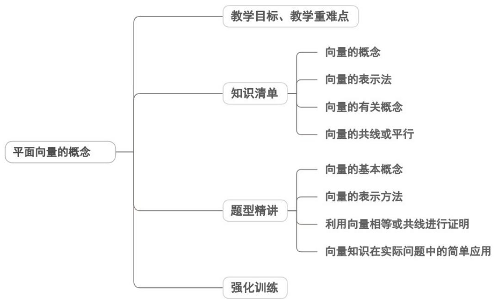

<!-- source-part:1 pages:1-28 -->

## 专题6.1 平面向量的概念

## 内容概览

## 教学目标、教学重难点

<table><tr><td>教学目标</td><td>1.了解平面向量的实际背景,通过位移、速度、力等物理量的分析,抽象概括出向量“既有大小又有方向”的本质属性,明确向量与数量的区别与联系。2.理解向量的模、零向量、单位向量的定义,明确零向量的方向任意性和单位向量的长度特征,能准确识别相关概念。3.刻理解相等向量与共线向量(平行向量)的本质特征,掌握相等向量“同向等长”、共线向量“方向相同或相反(含零向量)”的判定标准,能在具体图形中识别相等向量与共线向量。</td></tr><tr><td>教学重难点</td><td>1.重点相等向量与共线向量的定义及判定:明确“同向等长”是相等向量的充要条件,“方向相同或相反”是共线向量的核心特征,能在具体情境中准确判断。2.难点特殊向量的理解:尤其是零向量的方向任意性、所有零向量相等,以及单位向量“长度唯一但方向不唯一”的辨析,避免概念混淆。</td></tr></table>

## 知识清单

## 知识点 01 向量的概念

1、向量：既有大小又有方向的量叫做向量。

2、数量：只有大小，没有方向的量（如年龄、身高、长度、面积、体积和质量等），称为数量。
【即学即练】

1. 下列各量中是向量的是（）

【答案】
A．时间    B．路程    C．加速度    D．温度

【答案】C

【详解】因为时间、路程、温度只有大小没有方向，故是数量，加速度既有大小，又有方向，故是向量。

故选：C.

2. 下列关于向量的说法正确的是（）

【答案】
A．物理学中的摩擦力、重力都是向量 B．平面直角坐标系上的 x 轴、y 轴都是向量
C．温度含零上和零下温度，所以温度是向量 D．身高是一个向量

【答案】A
【详解】对于A，摩擦力和重力都及有大小，也有方向，所以摩擦力，重力都是向量，A正确；

对于 B，x 轴，y 轴有方向，但没有大小，所以它们都不是向量，B 错误；

对于 C，温度只有大小，没有方向，所以温度不是向量，C 错误；

对于 D，身高只有大小，没有方向，所以身高不是向量，D 错误；

故选:A.

## 知识点 02 向量的表示法

1、有向线段：具有方向的线段叫做有向线段，有向线段包含三个要素：起点、方向、长度。

2、向量的表示方法：

(1) 字母表示法：如 $a, b, c, \cdots$ 等.

（2）几何表示法：以 $A$ 为始点， $B$ 为终点作有向线段 $\overline{AB}$ （注意始点一定要写在终点的前面）。如果用一条有向线段 $\overline{AB}$ 表示向量，通常我们就说向量 $\overline{AB}$ 。

## 【即学即练】

1. 下列说法不正确的是 ( )

【答案】

A. 向量的模是一个正实数

B. 零向量没有方向

C. 单位向量的模等于 1 个单位长度

D. 零向量就是实数 0

【答案】ABD

【详解】对于 A，零向量的模等于零，故 A 错误；

对于 B，零向量有方向，其方向是任意的，故 B 错误；

对于 C，根据单位向量的定义可知 C 正确；

对于 D，零向量有大小还有方向，而实数 0 只有大小没有方向，故 D 错误.

故选：ABD.

2. 关于非零向量 $a$ 方向上的单位向量 $e$ ，下列说法正确的是（）

【答案】
A. $e$ 有无数个
B. $e$ 与 $a$ 可能反向
C. $e = 1$ D. $\vec{e} = \frac{a}{|a|}$

【答案】D

【详解】非零向量 $a$ 方向上的单位向量 $\vec{e} = \frac{a}{|a|}$ ，且 $|e| = 1$ ，故ABC错误，

故选：D.

## 知识点 03 向量的有关概念

1、向量的模：向量的大小叫向量的模（就是用来表示向量的有向线段的长度）.

(1) 向量 a 的模 $\left|a\right|$ 0

(2) 向量不能比较大小，但 $\left|a\right|$ 是实数，可以比较大小.

2、零向量：长度为零的向量叫零向量．记作 $^{0}$ ，它的方向是任意的．

3、单位向量：长度等于1个单位的向量.

(1) 在画单位向量时，长度 1 可以根据需要任意设定；

(2) 将一个向量除以它的模，得到的向量就是一个单位向量，并且它的方向与该向量相同。

4. 相等向量：长度相等且方向相同的向量。

## 【即学即练】

1. 下列说法不正确的有（）

【答案】
A．向量 $AB // CD$ 就是 $AB$ 所在的直线平行于 $CD$ 所在的直线
B．相等向量是长度相等，方向相同的向量
C．零向量与任一向量平行
D．共线向量是在一条直线上的向量

【答案】AD

【详解】对于A：向量AB与CD平行，包含AB所在的直线与CD所在的直线平行和重合两种情况，故A错误；
对于B：若两个向量长度相等，方向相同，则称两个向量为相等向量，故B正确；

对于 C：零向量与任一向量平行，故 C 正确；

对于 D：共线向量可以是在一条直线上的向量，也可以是所在直线互相平行的向量，故 D 错误.

故选：AD.

2. 下列说法不正确的有（）

【答案】
A. 向量 $\overline{AB} // \overline{CD}$ 就是 AB 所在的直线平行于 CD 所在的直线
B. 相等的非零向量是长度相等，方向相同的向量

C．零向量与任一向量平行

D．共线向量是在一条直线上的向量

【答案】AD

【详解】对于 A：向量 $\overline{AB}$ 与 $\overline{CD}$ 平行，包含 $\overline{AB}$ 所在的直线与 $\overline{CD}$ 所在的直线平行和重合两种情况，故 A 错误；

对于 B：若两个向量长度相等，方向相同，则称两个向量为相等向量，故 B 正确；

对于 C：零向量与任一向量平行，故 C 正确；

对于 D：共线向量可以是在一条直线上的向量，也可以是所在直线互相平行的向量，故 D 错误.

故选：AD.

## 知识点 04 向量的共线或平行

方向相同或相反的非零向量，叫共线向量（共线向量又称为平行向量）.

规定：0 与任一向量共线。

(1) 零向量的方向是任意的，注意 $^{0}$ 与0的含义与书写区别。

(2) 平行向量可以在同一直线上，要区别于两平行线的位置关系；共线向量可以相互平行，要区别于在同一

直线上的线段的位置关系.

（3）共线向量与相等向量的关系：相等向量一定是共线向量，但共线向量不一定是相等的向量。

【即学即练】

1. 已知非零向量 $a, b$ ，使得 $\left|a + b\right| = \left|a\right| - \left|b\right|$ 成立的充分非必要条件是（ ）.

【答案】

A. $a = 2b$ B. $a / / b$ C. $a + 2b = 0$ D. $\left|a\right| = 2\left|b\right|$

【答案】C

【详解】使得 $\left|a+b\right|=\left|a\right|-\left|b\right|$ 成立的充分条件是a和b反向且 $\left|\dot{a}\right|\quad\left|\dot{b}\right|$ ，
对于A，a和b是同向，所以A错误，
对于B，a和b可能同向，可能反向，所以B错误，
对于C，由 $a+2b=0$ ，得a=-2b，则a和b反向且 $\left|\dot{a}\right|\quad\left|\dot{b}\right|$ ，所以C正确，
对于D，由 $\left|\dot{a}\right|=2\left|\dot{b}\right|$ 可得a和b的方向不能确定，所以D错误.
故选：C.

2. 下列有关向量的说法正确的是（）

【答案】
A．向量又称有向线段
B．平行向量一定相等
C．平行向量一定共线
D．平面直角坐标系 $xOy$ 中的 $x$ 轴， $y$ 轴均为向量

【答案】C

【详解】向量可以用有向线段来表示，但向量与有向线段是不同的概念·有向线段有起点、方向和长度，而向量只有大小和方向，没有固定的起点·所以不能说向量又称有向线段，A选项错误.

平行向量是指方向相同或相反的非零向量，规定零向量与任意向量平行·而相等向量不仅要求方向相同，还要

求大小相等.所以平行向量不一定相等，B选项错误

平行向量也叫共线向量，这是向量的基本概念。所以平行向量一定共线，C选项正确。

向量是既有大小又有方向的量，而平面直角坐标系 $xOy$ 中的 $x$ 轴、 $y$ 轴是具有方向的直线，它们没有大小，

不满足向量的定义，所以 x 轴、y 轴不是向量，D 选项错误.

故选：C.

## 题型精讲

![[高中/课堂同步/题库/人教A版高中数学同步讲义(2026)/02_必修第二册/第六章 平面向量及其应用/专题6.1 平面向量的概念（高效培优讲义）/题型01_向量的基本概念/题型01_向量的基本概念.md]]
![[高中/课堂同步/题库/人教A版高中数学同步讲义(2026)/02_必修第二册/第六章 平面向量及其应用/专题6.1 平面向量的概念（高效培优讲义）/题型02_向量的表示方法/题型02_向量的表示方法.md]]
![[高中/课堂同步/题库/人教A版高中数学同步讲义(2026)/02_必修第二册/第六章 平面向量及其应用/专题6.1 平面向量的概念（高效培优讲义）/题型03_利用向量相等或共线进行证明/题型03_利用向量相等或共线进行证明.md]]
![[高中/课堂同步/题库/人教A版高中数学同步讲义(2026)/02_必修第二册/第六章 平面向量及其应用/专题6.1 平面向量的概念（高效培优讲义）/题型04_向量知识在实际问题中的简单应用/题型04_向量知识在实际问题中的简单应用.md]]
![[高中/课堂同步/题库/人教A版高中数学同步讲义(2026)/02_必修第二册/第六章 平面向量及其应用/专题6.1 平面向量的概念（高效培优讲义）/强化训练/强化训练.md]]
