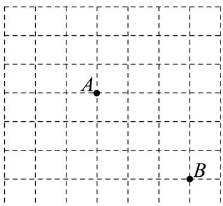

<!-- question-source:start -->
【变式1】如图所示的方格纸是由若干个边长为1的小正方形拼在一起组成的，方格纸中有两个定点 $A$ ， $B$ 点 $C$ 为小正方形的顶点，且 $\left|\overline{A} C\right| = \sqrt{5}$

(1)画出所有满足条件的向量 $AC$ ;

(2)求 $\left|\overline{BC}\right|$ 的最大值与最小值.
<!-- question-source:end -->

![[高中/课堂同步/题库/人教A版高中数学同步讲义(2026)/02_必修第二册/第六章 平面向量及其应用/专题6.1 平面向量的概念（高效培优讲义）/题型02_向量的表示方法/questions/answers/Q00078382A1.md]]
