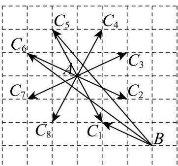

> [!faq]- 《专题6.1 平面向量的概念（高效培优讲义）》官方解析
>
> > [!success]- **【答案】** (1)答案见解析 (2)最大值为 $\sqrt{41}$ ，最小值为 $\sqrt{5}$
>
> > [!note]- **【解析】**
> > （1）画出所有满足条件的向量 $\overline{AC}$ ，即 $\overline{AC}_{i}$ （ $i=1,2,\ldots,8$ ），如图所示。
> >
> > 
> >
> > (2) 由 (1) 所画的图知，当点 $C$ 位于点 $C_1$ 或 $C_2$ 的位置时， $\left| \overline{BC} \right|$ 取得最小值 $\sqrt{1^2 + 2^2} = \sqrt{5}$ ；当点 $C$ 位于点 $C_5$ 或 $C_6$ 的位置时， $\left| \overline{BC} \right|$ 取得最大值 $\sqrt{4^2 + 5^2} = \sqrt{41}$ ，故 $\left| \overline{BC} \right|$ 的最大值为 $\sqrt{41}$ ，最小值为 $\sqrt{5}$ 。
