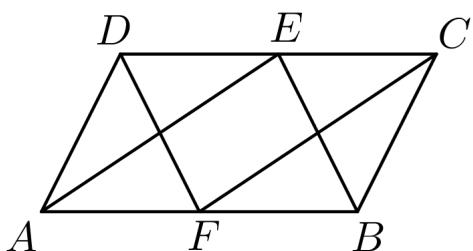

<!-- question-source:start -->
【变式2】如图所示，在平行四边形ABCD中，E，F分别是CD，AB的中点.

(1)写出与向量 $FC$ 共线的向量；

(2)求证： $BE = FD$ .
<!-- question-source:end -->

![[高中/课堂同步/题库/人教A版高中数学同步讲义(2026)/02_必修第二册/第六章 平面向量及其应用/专题6.1 平面向量的概念（高效培优讲义）/题型03_利用向量相等或共线进行证明/questions/answers/Q00078387A1.md]]
