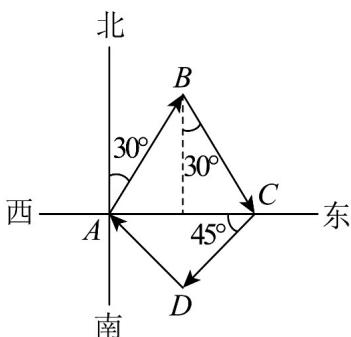

> [!faq]- 《专题6.1 平面向量的概念（高效培优讲义）》官方解析
>
> > [!success]- **【答案】** (1)答案见解析 (2) D 地在 A 地的东南方向，距 A 地 $1000 \sqrt{2} km$
>
> > [!note]- **【解析】**
> > （1）由题意，作出向量 $AB$ ， $BC$ ， $CD$ ， $DA$ ，如图所示.
> >
> > 
> >
> > (2) 依题意知，VABC 为正三角形，所以 AC = 2000km
> >
> > 又因为 $\angle ACD = 45^{\circ}$ ， $CD = 1000\sqrt{2}\mathrm{km}$
> >
> > 所以 $\triangle ACD$ 为等腰直角三角形，则 $AD = 1000\sqrt{2}\mathrm{km}$ ， $\angle CAD = 45^{\circ}$ ，
> >
> > 所以 D 地在 A 地的东南方向，距 A 地 $1000 \sqrt{2} km$
