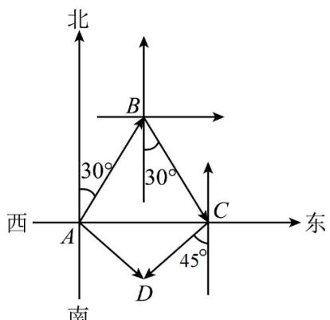

> [!faq]- 《专题6.1 平面向量的概念（高效培优讲义）》官方解析
>
> > [!success]- **【答案】** 答案见解析.
>
> > [!note]- **【解析】**
> > 以 A 为原点，正东方向为 x 轴正方向，正北方向为 y 轴正方向建立直角坐标系.
> >
> > 由题意知 B 点在第一象限，C 点在 x 轴正半轴上，D 点在第四象限，
> >
> > 向量 $AB, BC, CD$ 如图所示，
> >
> > 由已知可得，
> >
> > 
> >
> > 为正三角形，所以
> >
> > $AC = 2000km$
> >
> > 又 $\angle ACD = 45^{\circ}$ ， $CD = 1000\sqrt{2}km$ ，
> >
> > 所以 $\triangle ADC$ 为等腰直角三角形，
> >
> > 所以 $AD = 1000\sqrt{2}km$ ， $\angle CAD = 45^{\circ}$
> >
> > 故向量 $AD$ 的模为 $1000\sqrt{2} km$ ，方向为东南方向.
