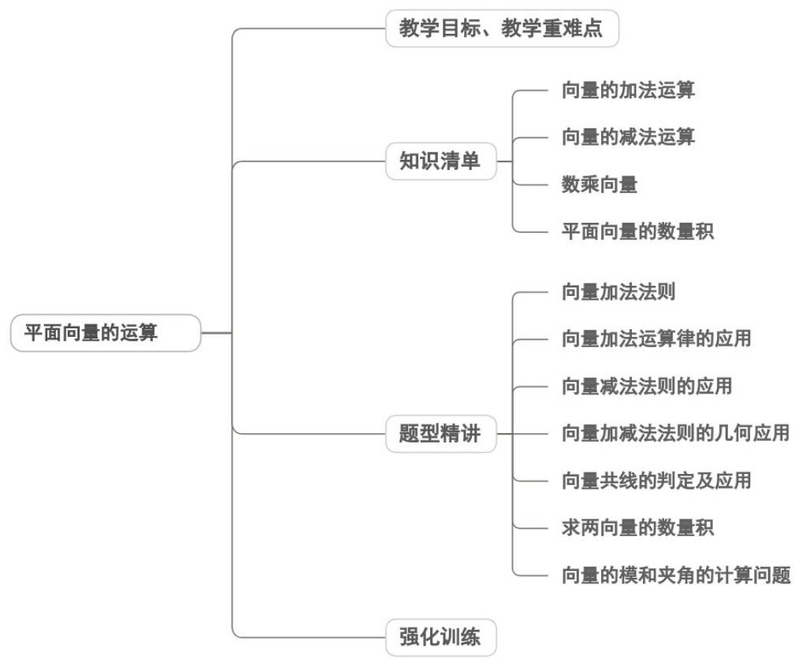
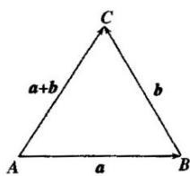
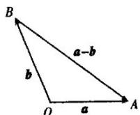
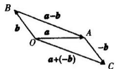
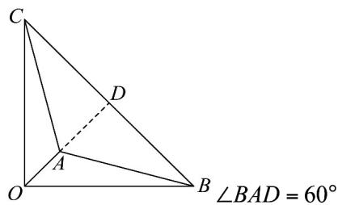
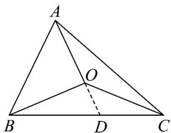
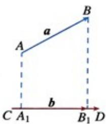
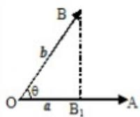
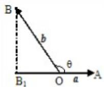
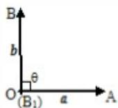

<!-- source-part:1 pages:1-42 -->

## 专题6.2 平面向量的运算

## 内容概览

## 教学目标、教学重难点

<table><tr><td>教学目标</td><td>1.掌握平面向量的加法、减法、数乘向量的定义、几何法则(三角形/平行四边形/多边形法则、相反向量法)和运算表示,能规范进行向量的线性运算。2.理解平面向量线性运算的运算律(交换律、结合律、数乘分配律),能运用运算律简化向量运算。3.掌握向量共线定理,能利用定理判定两个向量是否共线,解决简单的共线问题。</td></tr><tr><td>教学重难点</td><td>1.重点平面向量加法、减法、数乘向量的几何法则和代数表示,能熟练进行线性运算。2.难点向量共线定理的条件辨析:理解“非零向量,存在唯一实数使”中“非零”和“唯一”的必要性,避免忽略零向量的特殊情况。</td></tr></table>

## 知识清单

## 知识点 01 向量的加法运算

## 1、向量加法的概念及三角形法则

已知向量 $a, b$ ，在平面内任取一点 $A$ ，作 $\overline{AB} = a, \overline{BC} = b$ ，再作向量 $\overline{AC}$ ，则向量 $\overline{AC}$ 叫做 $a$ 与 $b$ 的和，记

作 $a + b$ ，即 $a + b = AB + BC = AC$ .如图

本定义给出的向量加法的几何作图方法叫做向量加法的三角形法则.

## 2、向量加法的平行四边形法则

已知两个不共线向量 $a, b$ ，作 $\overline{AB} = a, \overline{AD} = b$ ，则 $A, B, D$ 三点不共线，以 $\overline{AB}, \overline{AD}$ 为邻边作平行四边形 $ABCD$ ，则对角线 $\overline{AC} = a + b$ 。这个法则叫做两个向量求和的平行四边形法则。

求两个向量和的运算，叫做向量的加法。

对于零向量与任一向量 $a$ ，我们规定 $a + 0 = 0 + a = a$

## 3、向量求和的多边形法则的概念

已知 $n$ 个向量，依次把这 $n$ 个向量首尾相连，以第一个向量的起点为起点，第 $n$ 个向量的终点为终点的向量

叫做这 $n$ 个向量的和向量．这个法则叫做向量求和的多边形法则．

$$
A _ {1} A _ {n} = A _ {1} A _ {2} + A _ {2} A _ {3} + \dots + A _ {n - 1} A _ {n}
$$

特别地，当 $A_{1}$ 与 $A_{n}$ 重合，即一个图形为封闭图形时，有 $\overline{A_1A_2} +\overline{A_2A_3} +\dots +\overline{A_{n - 1}A_n} +\overline{A_nA_1} = 0$

## 4、向量加法的运算律

(1) 交换律： $a + b = b + a$ ;

(2) 结合律： $(a + b) + c = a + (b + c)$

## 【即学即练】

1. 已知在三角形 $\forall ABC$ 中， $AB = a$ ， $BC = b$ ，用 $a$ ， $b$ 表示向量 $CA = (\quad)$ A. $a + b$ B. $a - b$ C. $-a + b$ D. $-a - b$

【答案】D

【详解】 $\overline{CA}=-\overline{AC}=-\left(\overline{AB}+\overline{BC}\right)=-\left(a+b\right)=-a-b$

故选:D.

2. 下列命题中错误的有（）

【答案】
A. $\left|a\right|=\left|b\right|$ ，则 a=b
B. 若 $a \parallel b, b \parallel c$ ，则 $a \parallel c$

C. 若 $a \parallel b (b \neq 0)$ ，则存在实数 $\lambda$ ，使得 $a = \lambda b$ D. $\left|a + b\right| \leq |a| + |b|$

【答案】AB

【详解】对于 A，a=b 的充要条件是 $\left|a\right|=\left|b\right|$ 且 a,b 方向相同，A 错误；

对于 B，若 $a \parallel b, b \parallel c$ ，当 b = 0 时，a, c 不一定共线，B 错误；

对于 C，若 $a // b (b \neq 0)$ ，则存在实数 $\lambda$ ，使得 $a = \lambda b$ ，C 正确；

对于 D，根据向量加减法的三角形法则和平行四边形法则，可知 $\left|\left|a\right|-\left|b\right|\right|\leq\left|a+b\right|\leq\left|a\right|+\left|b\right|$ ，D 正确，

故选：AB

## 知识点 02 向量的减法运算

## 1、向量的减法

（1）如果 $b + x = a$ ，则向量 $x$ 叫做 $a$ 与 $b$ 的差，记作 $a - b$ ，求两个向量差的运算，叫做向量的减法．此定

义是向量加法的逆运算给出的.

相反向量：与向量 $a$ 方向相反且等长的向量叫做 $a$ 的相反向量。

(2) 向量 $a$ 加上 $b$ 的相反向量，叫做 $a$ 与 $b$ 的差，即 $a - b = a + (-b)$ 。求两个向量差的运算，叫做向量的

减法，此定义是利用相反向量给出的，其实质就是把向量减法化为向量加法。

2、向量减法的作图方法

（1）已知向量 $a$ ， $b$ ，作 $\overline{OA} = a,\overline{OB} = b$ ，则 $\overline{BA} = a - b = \overline{OA} -\overline{OB}$ ，即向量 $\overline{BA}$ 等于终点向量（ $\overline{OA}$ ）减

去起点向量（OB）。利用此方法作图时，把两个向量的始点放在一起，则这两个向量的差是以减向量的终

点为始点的，被减向量的终点为终点的向量。

（2）利用相反向量作图，通过向量加法的平行四边形法则作出 $a - b$ 。作 $OA = a, OB = b, AC = -b$ ，则 $OC = a + (-b)$ ，如图。由图可知，一个向量减去另一个向量等于加上这个向量的相反向量。

## 【即学即练】

1. 化简 $(AB - MC) + (MA + BN) = (\quad)$ A. 0 B. CN C. BM D. AC

【答案】B

【详解】 $\left( \begin{array}{cc} \square & \square \\ AB & MC \end{array} \right) + \left( \begin{array}{cc} \square & \square \\ MA & BN \end{array} \right) = AB + BN + MA - MC = AN + MA - MC = MN - MC = CN$ .故选：B

2．若 $\forall ABC$ 的三个内角均小于 $120^{\circ}$ ，点 $M$ 满足 $\angle AMB=\angle AMC=\angle BMC=120^{\circ}$ ，则点 $M$ 到三角形三个顶点的距离之和最小，点 $M$ 被人们称为费马点。根据以下性质，已知 $a$ 是平面内的任意一个向量，向量 $b$ ， $c$ 满足 $b\perp c$ ，且 $|b|=|c|=\sqrt{2}$ ，则 $|a-b|+|a|+|a+c|$ 的最小值为（）A． $2\sqrt{2}$ B． $\sqrt{3}+1$ C． $\frac{2\sqrt{3}}{3}$ D． $\sqrt{2}+1$

【答案】B

【详解】作向量 $\overline{OA}=a,\overline{OB}=b,\overline{OC}=-c$ ，由 $b\perp c,\left|b\right|=\left|c\right|=\sqrt{2}$ ，得 $\triangle OBC$ 是腰长为 $\sqrt{2}$ 的等腰三角形， $\left|a-b\right|+\left|a\right|+\left|a+c\right|=\left|\overline{BA}\right|+\left|\overline{OA}\right|+\left|\overline{CA}\right|$ ，而 $\triangle OBC$ 的所有内角均小于 $120^{\circ}$

因此 $|a - b| + |a| + |a + c|$ 取得最小值的点 $A$ 是 $\triangle OBC$ 的费马点，

$\angle BAC = \angle OAC = \angle OAB = 120^{\circ}$ ，则 $AB = AC$ ，点 $A$ 在斜边 $BC$ 的中线上，如图，

$$
\angle B A D = 6 0 ^ {\circ} \quad A C = A B = 2 A D = B C \tan 3 0 ^ {\circ} = \frac {2 \sqrt {3}}{3} \quad A O = A D - O D = 1 - \frac {\sqrt {3}}{3}
$$

所以 $|a-b|+|a|+|a+c|$ 的最小值为 $\frac{2\sqrt{3}}{3}+\frac{2\sqrt{3}}{3}+1-\frac{\sqrt{3}}{3}=\sqrt{3}+1$ .故选：B

## 知识点 03 数乘向量

## 1、向量数乘的定义

实数与向量的积：实数 $\lambda$ 与向量 $\vec{a}$ 的积是一个向量，记作： $\lambda a$

(1) $|\lambda a| = |\lambda ||a|$ ;

(2) ①当 $\lambda > 0$ 时， $\lambda \vec{a}$ 的方向与 $\vec{a}$ 的方向相同；

②当 $\lambda < 0$ 时， $\lambda \vec{a}$ 的方向与 $\vec{a}$ 的方向相反；

③当 $\lambda=0_{时}$ ， $\lambda\vec{a}=\vec{0}$

## 2、向量数乘的几何意义

由实数与向量积的定义知，实数与向量的积 $\lambda \vec{a}$ 的几何意义是： $\lambda \vec{a}$ 可以由 $a$ 同向或反向伸缩得到。当 $|\lambda| > 1$ 时，表示向量 $a$ 的有向线段在原方向（ $\lambda > 0$ ）或反方向（ $\lambda < 0$ ）上伸长为原来的 $|\lambda|$ 倍得到 $\lambda \vec{a}$ ；当 $0 < |\lambda| < 1$ 时，表示向量 $a$ 的有向线段在原方向（ $\lambda > 0$ ）或反方向（ $\lambda < 0$ ）上缩短为原来的 $|\lambda|$ 倍得到 $\lambda \vec{a}$

；当 $\lambda = 1$ 时， $\lambda \vec{a} = a$ ；当 $\lambda = -1$ 时， $\lambda \vec{a} = -a$ ，与 $a$ 互为相反向量；当 $\lambda = 0$ 时， $\lambda \vec{a} = 0$ 。实数与向量的积

得几何意义也是求作向量 $\lambda \vec{a}$ 的作法.

## 3、向量数乘的运算律

设 $\lambda$ 、 $\mu$ 为实数

结合律： $\lambda (\mu a) = (\lambda \mu)a$

分配律： $(\lambda +\mu)a = \lambda a + \mu a$ ， $\lambda (a + b) = \lambda a + \lambda b$

【即学即练】

1. 已知点 $O$ 是 $\forall ABC$ 内一点，求证： $S_{\triangle BOC} \overline{OA} + S_{\triangle COA} \overline{OB} + S_{\triangle AOB} \overline{OC} = 0$

【答案】证明见解析

【详解】如图，延长AO，交线段BC于点D。

因为 A, O, D 三点共线，

所以 $\frac{AO}{AD}\frac{AO}{AD}=\frac{AO}{AD}\left(\frac{DC}{BC}\frac{AB}{AC}+\frac{DB}{BC}\frac{AC}\right)=\frac{S_{\triangle OAC}}{S_{\triangle DAC}}\cdot\frac{S_{\triangle DAC}}{S_{\triangle BAC}}\frac{AB}{AC}+\frac{S_{\triangle OAB}}{S_{\triangle DAB}}\cdot\frac{S_{\triangle DAB}}{S_{\triangle BAC}}\frac{AC}{AC}$

$$
= \frac {S _ {\triangle O A C}}{S _ {\triangle B A C}} \left(\stackrel {\square \square \square} {A O} + \stackrel {\square \square \square} {O B}\right) + \frac {S _ {\triangle O A B}}{S _ {\triangle B A C}} \left(\stackrel {\square \square \square} {A O} + \stackrel {\square \square \square} {O C}\right)
$$

所以 $S_{\triangle ABC} \stackrel{\square\square\square}{AO} = S_{\triangle OAC}\left(\stackrel{\square\square\square}{AO} + \stackrel{\square\square\square}{OB}\right) + S_{\triangle OAB}\left(\stackrel{\square\square\square}{AO} + \stackrel{\square\square\square}{OC}\right)$

所以 $S_{\triangle BOC} \overline{OA} + S_{\triangle COA} \overline{OB} + S_{\triangle AOB} \overline{OC} = 0$

2．已知 O 为 $\forall ABC$ 所在平面内一点，若 $aOA + bOB + cOC = 0$ ，其中内角 A, B, C 的对边分别为 a, b, c，则点 O 是 $\forall ABC$ 的（）

【答案】

A．外心    B．内心    C．重心    D．垂心

【答案】B

【详解】因为 $OB = OA + AB$ ， $OC = OA + AC$ ，

所以 $\left(a + b + c\right)\overline{OA} +b\overline{AB} +c\overline{AC} = 0$

所以 $AO=\frac{b}{a+b+c}AB+\frac{c}{a+b+c}AC$ ( \* ) .

又因为 $\overline{AB}=ce_{1}$ ， $\overline{AC}=be_{2}$ ，其中 $e_{1},e_{2}$ 分别表示 $\overline{AB}$ ， $\overline{AC}$ 方向的单位向量，

( \* )式可进一步化为 $AO=\frac{bc}{a+b+c}\left(\vec{e_{1}}+\vec{e_{2}}\right)$ ,

而 $e_1 + e_2$ 表示与 $\angle BAC$ 的平分线共线的向量，

所以 AO 平分 $\angle BAC$

同理，BO 平分 $\angle ABC$ ，CO 平分 $\angle ACB$ ，

所以 O 是 $\vee ABC$ 的内心，

故选：B.

## 知识点 04 平面向量的数量积

1、平面向量数量积（内积）的定义：已知两个非零向量 $\vec{a}$ 与 $b$ ，它们的夹角是 $\theta$ ，则数量 $\left|a\right|\left|b\right|\cos \theta$ 叫 $a$ 与 $b$ 的数量积，记作 $a\cdot b$ ，即有 $a\cdot b = |a|\cdot |b|\cos \theta (0\leq \theta \leq \pi)$ .并规定0与任何向量的数量积为0.

2、如图（1），设 $a, b$ 是两个非零向量， $AB = a$ ， $CD = b$ ，作如下变换：过 $AB$ 的起点 $A$ 和终点 $B$ ，分别作 $CD$ 所在直线的垂线，垂足分别为 $A_1, B_1$ ，得到 $A_1B_1$ ，我们称上述变换为向量 $a$ 向向量 $b$ 投影， $A_1B_1$ 叫做向量 $a$ 在向量 $b$ 上的投影向量。

(1)

(2)

如图（2），在平面内任取一点 $O$ ，作 $\overline{OM} = a, \overline{ON} = b$ 。过点 $M$ 作直线 $ON$ 的垂线，垂足为 $M_1$ ，则 $\overline{OM}_1$ 就是向量 $a$ 在向量 $b$ 上的投影向量。

3、平面向量数量积的几何意义

数量积 $a \cdot b$ 表示 $a$ 的长度 $|a|$ 与 $b$ 在 $a$ 方向上的投影 $\left|b\right|\cos \theta$ 的乘积，这是 $a \cdot b$ 的几何意义。图所示分别是两向量 $a, b$ 夹角为锐角、钝角、直角时向量 $b$ 在向量 $a$ 方向上的投影的情形，其中 $OB_{1} = |b|\cos \theta$ ，它的意义是，向量 $b$ 在向量 $a$ 方向上的投影是向量 $OB_{1}$ 的数量，即 $\vec{OB}_{1} = OB_{1} \cdot \frac{a}{|a|}$ 。

(1)

(2)

(3)

事实上，当 $\theta$ 为锐角时，由于 $\cos \theta > 0$ ，所以 $OB_{1} > 0$ ；当 $\theta$ 为钝角时，由于 $\cos \theta < 0$ ，所以 $OB_{1} < 0$ ；当 $\theta = 90^{0}$ 时，由于 $\cos \theta = 0$ ，所以 $OB_{1} = 0$ ，此时 $O$ 与 $B_{1}$ 重合；当 $\theta = 0^{0}$ 时，由于 $\cos \theta = 1$ ，所以 $OB_{1} = |b|$ ；当 $\theta = 180^{0}$ 时，由于 $\cos \theta = -1$ ，所以 $OB_{1} = -|b|$ 。

## 4、向量数量积的性质

设 $a$ 与 $b$ 为两个非零向量， $e$ 是与 $b$ 同向的单位向量。

(1) $e \cdot a = a \cdot e = |a| \cos \theta$

(2) $a \perp b \Leftrightarrow a \cdot b = 0$

(3) 当 $a$ 与 $b$ 同向时， $a \cdot b = |a| \cdot |b|$ ；当 $a$ 与 $b$ 反向时， $a \cdot b = -|a||b|$ 。特别的 $a \cdot a = |a|^2$ 或 $|a| = \sqrt{a \cdot a}$ (4) $\cos \theta = \frac{a \cdot b}{|a| \cdot |b|}$ (5) $|a \cdot b| \leq |a||b|$

## 5、向量数量积的运算律

(1) 交换律： $a \cdot b = b \cdot a$

(2) 数乘结合律： $\left(\lambda a\right)\cdot b=\lambda\left(a\cdot b\right)=a\cdot\left(\lambda b\right)$

(3) 分配律： $(a+b)\cdot c=a\cdot c+b\cdot c$

## 【即学即练】

1．如图，在菱形ABCD中， $AB=2,\angle DAB=60^{\circ},E$ 为CD上靠近于C的三等分点，则 $AD\cdot AE$ 的值是\_\_\_\_

【答案】

【答案】 $\frac{16}{3}$

【详解】因为 $E$ 为 $CD$ 上靠近于 $C$ 的三等分点，所以 $\frac{DE}{3} = \frac{2DC}{3} = \frac{2AB}{3}$

所以 $AE = AD + DE = AD + \frac{2}{3} AB$

又 $AB = AD = 2, \angle DAB = 60^{\circ}$ ，所以 $AB \cdot AD = 2 \times 2 \times \cos 60^{\circ} = 2$

所以 $AD \cdot AE = AD \cdot \left( AD + \frac{2}{3} AB \right) = AD^{2} + \frac{2}{3} AD \cdot AB = 2^{2} + \frac{2}{3} \times 2 = \frac{16}{3}$

故答案为： $\frac{16}{3}$

2．已知a，b的夹角为 $120^{\circ}$ ，且 $\left|a\right|=4,\left|b\right|=2$ ，求：

(1) $(a-2b)\cdot(a+b)$ ;

(2) $\left|a+b\right|$ ;

(3) $a+b$ 与a的夹角.

【答案】(1)12

(2) $2\sqrt{3}$

(3) $\frac{\pi}{6}$

$a \cdot b = 4 \times 2 \times \left(-\frac{1}{2}\right) = -4$ 【详解】（1）由题意可知，

则 $(a-2b)\cdot(a+b)=a^{2}-a\cdot b-2b^{2}=16+4-8=12$ ；

(2) $\left|a+b\right|=\sqrt{a^{2}+2a\cdot b+b^{2}}=\sqrt{16-8+4}=2\sqrt{3}$ ;

(3) $\left(a + b\right)\cdot a = a^2 +a\cdot b = 16 - 4 = 12$

则 $\cos\left\langle a+b,a\right\rangle=\frac{\left(a+b\right)\cdot a}{\left|a+b\right|\cdot\left|a\right|}=\frac{12}{2\sqrt{3}\times4}=\frac{\sqrt{3}}{2}$

因 $\left\langle a + b, a \right\rangle \in (0, \pi)$ ，则 $\left\langle a + b, a \right\rangle = \frac{\pi}{6}$

故 $a + b$ 与 $a$ 的夹角为 $\frac{\pi}{6}$

## 题型精讲

![[高中/课堂同步/题库/人教A版高中数学同步讲义(2026)/02_必修第二册/第六章 平面向量及其应用/专题6.2 平面向量的运算（高效培优讲义）/题型01_向量加法法则/题型01_向量加法法则.md]]
![[高中/课堂同步/题库/人教A版高中数学同步讲义(2026)/02_必修第二册/第六章 平面向量及其应用/专题6.2 平面向量的运算（高效培优讲义）/题型02_向量加法运算律的应用/题型02_向量加法运算律的应用.md]]
![[高中/课堂同步/题库/人教A版高中数学同步讲义(2026)/02_必修第二册/第六章 平面向量及其应用/专题6.2 平面向量的运算（高效培优讲义）/题型03_向量减法法则的应用/题型03_向量减法法则的应用.md]]
![[高中/课堂同步/题库/人教A版高中数学同步讲义(2026)/02_必修第二册/第六章 平面向量及其应用/专题6.2 平面向量的运算（高效培优讲义）/题型04_向量加减法法则的几何应用/题型04_向量加减法法则的几何应用.md]]
![[高中/课堂同步/题库/人教A版高中数学同步讲义(2026)/02_必修第二册/第六章 平面向量及其应用/专题6.2 平面向量的运算（高效培优讲义）/题型05_向量共线的判定及应用/题型05_向量共线的判定及应用.md]]
![[高中/课堂同步/题库/人教A版高中数学同步讲义(2026)/02_必修第二册/第六章 平面向量及其应用/专题6.2 平面向量的运算（高效培优讲义）/题型06_求两向量的数量积/题型06_求两向量的数量积.md]]
![[高中/课堂同步/题库/人教A版高中数学同步讲义(2026)/02_必修第二册/第六章 平面向量及其应用/专题6.2 平面向量的运算（高效培优讲义）/题型07_向量的模和夹角的计算问题/题型07_向量的模和夹角的计算问题.md]]
![[高中/课堂同步/题库/人教A版高中数学同步讲义(2026)/02_必修第二册/第六章 平面向量及其应用/专题6.2 平面向量的运算（高效培优讲义）/强化训练/强化训练.md]]
